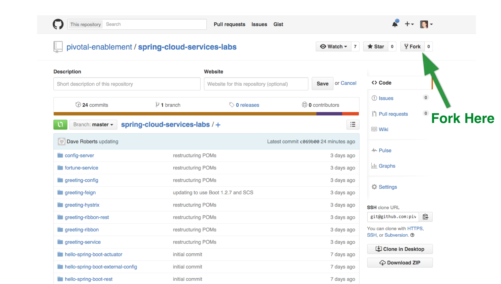

# Labs Setup

### Set up the `spring-cloud-services-labs` Repo
1) Fork the labs repo to your account.  Browse to: https://github.com/pivotal-enablement/spring-cloud-services-labs.  Then fork the repo.


2) GitHub displays your new fork. Copy the HTTPS clone URL from your fork.

3) Open a new terminal window.  Clone your fork of the `spring-cloud-services-labs`.  This contains several applications used to demonstrate cloud native architectures.  Get familiar with the sub directories.  We recommend organizing your work into a `repos` directory.  A `repos` directory is where you will clone repositories and perform your work.  Throughout the labs we will reference this directory as `$REPOS_HOME`.

```bash
$ cd $REPOS_HOME
$ git clone <Your fork of the spring-cloud-services-labs repo - HTTPS clone URL>
$ cd spring-cloud-services-labs
```

`$REPOS_HOME/spring-cloud-services-labs` will be referred to `$SPRING_CLOUD_SERVICES_LABS_HOME` throughout the labs.

4) OPTIONAL STEP - Import applications into your IDE such as Spring Tool Suite (STS).  Importing projects at the `spring-cloud-services-labs` level is recommended because there are several projects. Otherwise, use your favorite editor.

*STS Import Help:*

Select File > Import... Then select Maven > Existing Maven Projects. On the Import Maven Projects page, browse to your spring-cloud-services-labs directory. Make sure all projects are selected and click Finish.
