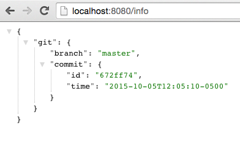
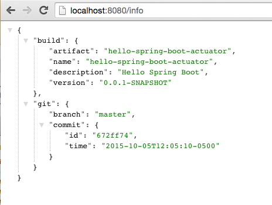
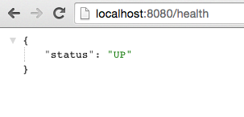
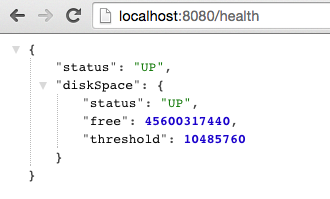
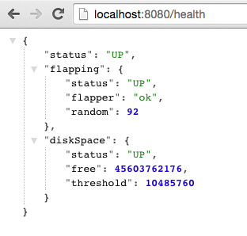
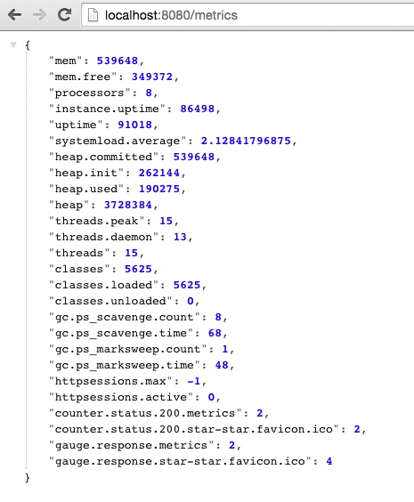
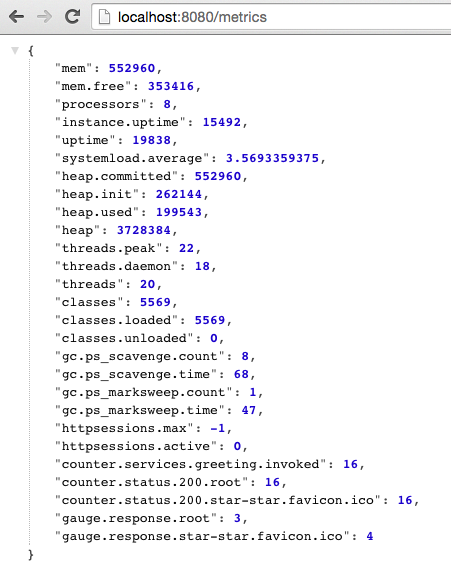

# Introspection, Monitoring, and Metrics using Spring Boot Actuator

<!-- TOC depth:6 withLinks:1 updateOnSave:1 orderedList:0 -->

- [Introspection, Monitoring, and Metrics using Spring Boot Actuator](#introspection-monitoring-and-metrics-using-spring-boot-actuator)
	- [Requirements](#requirements)
	- [What You Will Learn](#what-you-will-learn)
	- [Exercises](#exercises)
		- [Set up the Actuator](#set-up-the-actuator)
		- [Introspection Endpoints](#introspection-endpoints)
		- [Include Version Control Info](#include-version-control-info)
		- [Include Build Info](#include-build-info)
		- [Health Indicators](#health-indicators)
		- [Metrics](#metrics)
<!-- /TOC -->

Estimated Time: 30 minutes

## Requirements

[Lab Requirements](../requirements.md)


## What You Will Learn

* How to use the endpoints that the `actuator` exposes to manage applications


## Exercises

### Set up the Actuator

Spring Boot includes a number of additional features to help you monitor and manage your application when it’s pushed to production.  These features are added by adding `spring-boot-starter-actuator` to the classpath.

1) Review the following file: `$CLOUD_NATIVE_APP_LABS_HOME/hello-spring-boot-actuator/pom.xml`.

```xml
<dependency>
	<groupId>org.springframework.boot</groupId>
	<artifactId>spring-boot-starter-actuator</artifactId>
</dependency>
```


### Introspection Endpoints

1.) Open a new terminal window.  Run the `hello-spring-boot-actuator` application:

```bash
$ cd $CLOUD_NATIVE_APP_LABS_HOME/hello-spring-boot-actuator
$ mvn clean spring-boot:run
```

Try out the following endpoints. The output is omitted here because it can be quite large:

[http://localhost:8080/beans](http://localhost:8080/beans)

Dumps all of the beans in the Spring context.

[http://localhost:8080/autoconfig](http://localhost:8080/autoconfig)

Dumps all of the auto-configuration performed as part of application bootstrapping.

[http://localhost:8080/configprops](http://localhost:8080/configprops)

Displays a collated list of all `@ConfigurationProperties`.

[http://localhost:8080/env](http://localhost:8080/env)

Dumps the application’s shell environment as well as all Java system properties.

[http://localhost:8080/mappings](http://localhost:8080/mappings)

Dumps all URI request mappings and the controller methods to which they are mapped.

[http://localhost:8080/dump](http://localhost:8080/dump)

Performs a thread dump.

[http://localhost:8080/trace](http://localhost:8080/trace)

Displays trace information (by default the last few HTTP requests).

2) Stop the `hello-spring-boot-actuator` application.

### Include Version Control Info

Spring Boot provides an endpoint (http://localhost:8080/info) that allows the exposure of arbitrary metadata.  By default, it is empty.


One thing that `actuator` does well is expose information about the specific build and version control coordinates for a given deployment.

1) Edit the following file: `$CLOUD_NATIVE_APP_LABS_HOME/hello-spring-boot-actuator/pom.xml`.  Add the `git-commit-id-plugin` to your Maven build.  _You must edit the file._  The `git-commit-id-plugin` adds Git branch and commit coordinates to the `/info` endpoint:

```xml
<plugin>
	<groupId>pl.project13.maven</groupId>
	<artifactId>git-commit-id-plugin</artifactId>
	<configuration>
			<dotGitDirectory>../.git</dotGitDirectory>
	</configuration>
</plugin>
```

**NOTE**
The path `../.git` refers to the `.git` directory at the root of the lab materials repo.

Completed:
```xml
<?xml version="1.0" encoding="UTF-8"?>
<project xmlns="http://maven.apache.org/POM/4.0.0" xmlns:xsi="http://www.w3.org/2001/XMLSchema-instance"
	xsi:schemaLocation="http://maven.apache.org/POM/4.0.0 http://maven.apache.org/xsd/maven-4.0.0.xsd">
	<modelVersion>4.0.0</modelVersion>

	<groupId>io.pivotal</groupId>
	<artifactId>hello-spring-boot-actuator</artifactId>
	<version>0.0.1-SNAPSHOT</version>
	<packaging>jar</packaging>

	<name>hello-spring-boot-actuator</name>
	<description>Hello Spring Boot</description>

	<parent>
		<groupId>org.springframework.boot</groupId>
		<artifactId>spring-boot-starter-parent</artifactId>
		<version>1.2.6.RELEASE</version>
		<relativePath /> <!-- lookup parent from repository -->
	</parent>

	<properties>
		<project.build.sourceEncoding>UTF-8</project.build.sourceEncoding>
		<java.version>1.8</java.version>
	</properties>

	<dependencies>
		<dependency>
			<groupId>org.springframework.boot</groupId>
			<artifactId>spring-boot-starter-web</artifactId>
		</dependency>
		<dependency>
			<groupId>org.springframework.boot</groupId>
			<artifactId>spring-boot-starter-actuator</artifactId>
		</dependency>
		<dependency>
			<groupId>org.springframework.boot</groupId>
			<artifactId>spring-boot-starter-test</artifactId>
			<scope>test</scope>
		</dependency>
	</dependencies>

	<build>
		<plugins>
			<plugin>
				<groupId>org.springframework.boot</groupId>
				<artifactId>spring-boot-maven-plugin</artifactId>
			</plugin>
			<plugin>
				<groupId>pl.project13.maven</groupId>
				<artifactId>git-commit-id-plugin</artifactId>
				<configuration>
					<dotGitDirectory>../.git</dotGitDirectory>
				</configuration>
			</plugin>
		</plugins>
	</build>


</project>

```
2) Run the `hello-spring-boot-actuator` application:

```bash
$ mvn clean spring-boot:run
```
3) Browse to [http://localhost:8080/info](http://localhost:8080/info).  Git commit information is now included.



4) Stop the `hello-spring-boot-actuator` application.

***What Just Happened?***

By including the `git-commit-id-plugin`, details about git commit information will be included in the `/info` endpoint.  Git information is captured in a `git.properties` file that is generated with the build.  Review the following file: `$CLOUD_NATIVE_APP_LABS_HOME/hello-spring-boot-actuator/target/classes/git.properties`.

### Include Build Info

1) Add the following properties to `$CLOUD_NATIVE_APP_LABS_HOME/hello-spring-boot-actuator/src/main/resources/application.yml`.  _You must edit the file._

```yaml
greeting: Hello
info: # add this section
  build:
    artifact: @project.artifactId@
    name: @project.name@
    description: @project.description@
    version: @project.version@
```

These will add the project’s Maven coordinates to the `/info` endpoint. The Spring Boot Maven plugin will cause them to automatically be replaced in the assembled JAR.

**NOTE:** if STS reports a problem with the `application.yml` due to `@` character the problem can safely be ignored.

2) Build and run the `hello-spring-boot-actuator` application:

```
$ mvn package
$ java -jar target/hello-spring-boot-actuator-0.0.1-SNAPSHOT.jar
```

3) Browse to [http://localhost:8080/info](http://localhost:8080/info).  Build information is now included.


4) Stop the `hello-spring-boot-actuator` application.

***What Just Happened?***

We have mapped Maven properties from the `pom.xml` into the `/info` endpoint.

Read more about exposing data in the `/info` endpoint [here](http://docs.spring.io/spring-boot/docs/current/reference/htmlsingle/#production-ready).

### Health Indicators

Spring Boot provides an endpoint [http://localhost:8080/health](http://localhost:8080/health) that allows for the notion of various health indicators.

Normally, when Spring Security is not enabled, the `/health` endpoint will only expose an `UP` or `DOWN` value.


1) To simplify working with the endpoint for this lab, we will turn off its sensitivity. Add the following to `$CLOUD_NATIVE_APP_LABS_HOME/hello-spring-boot-actuator/src/main/resources/application.yml`:

```yaml
greeting: Hello
info:
  build:
    artifact: @project.artifactId@
    name: @project.name@
    description: @project.description@
    version: @project.version@
endpoints: # add this section
  health:
    sensitive: false
```

2) Build and run the `hello-spring-boot-actuator` application:

```
$ mvn package
$ java -jar target/hello-spring-boot-actuator-0.0.1-SNAPSHOT.jar
```

3) Browse to [http://localhost:8080/health](http://localhost:8080/health).  Out of the box is a `DiskSpaceHealthIndicator` that monitors health in terms of available disk space.  Would your Ops team like to know if the app is close to running out of disk space?  `DiskSpaceHealthIndicator` can be customized via `DiskSpaceHealthIndicatorProperties`.  For instance, setting a different threshold for when to report the status as `DOWN`.



4) Stop the `hello-spring-boot-actuator` application.

5) Create the class `io.pivotal.hello.FlappingHealthIndicator` (`$CLOUD_NATIVE_APP_LABS_HOME/hello-spring-boot-actuator/src/main/java/io/pivotal/hello/FlappingHealthIndicator.java`) and into it paste the following code:

```java
package io.pivotal.hello;

import java.util.Random;

import org.springframework.boot.actuate.health.Health;
import org.springframework.boot.actuate.health.HealthIndicator;
import org.springframework.stereotype.Component;

@Component
public class FlappingHealthIndicator implements HealthIndicator {

    private Random random = new Random(System.currentTimeMillis());

    @Override
    public Health health() {
        int result = random.nextInt(100);
        if (result < 50) {
            return Health.down().withDetail("flapper", "failure").withDetail("random", result).build();
        } else {
            return Health.up().withDetail("flapper", "ok").withDetail("random", result).build();
        }
    }
}
```

This demo health indicator will randomize the health check.

6) Build and run the `hello-spring-boot-actuator` application:

```
$ mvn package
$ java -jar target/hello-spring-boot-actuator-0.0.1-SNAPSHOT.jar
```

6) Browse to [http://localhost:8080/health](http://localhost:8080/health) and verify that the output is similar to the following (and changes randomly!).


7) Stop the `hello-spring-boot-actuator` application.

### Metrics

Spring Boot provides an endpoint [http://localhost:8080/metrics](http://localhost:8080/metrics) that exposes several automatically collected metrics for your application. It also allows for the creation of custom metrics.

1) Build and run the `hello-spring-boot-actuator` application:

```
$ mvn package
$ java -jar target/hello-spring-boot-actuator-0.0.1-SNAPSHOT.jar
```

2) Browse to [http://localhost:8080/metrics](http://localhost:8080/metrics).  Review the metrics exposed.



3) Let's add some custom metrics.  We have refactored the greeting into a service of its own.  Open the following file: `$CLOUD_NATIVE_APP_LABS_HOME/hello-spring-boot-actuator/src/main/java/io/pivotal/hello/GreetingService.java`.

Uncomment this line:
```java
		//counterService.increment("counter.services.greeting.invoked");
```

Notice the `counterService`.  This service allows for any metric to be counted.

```java
   @Autowired
   CounterService counterService;
```

4) Review the following file to see how the `GreetingService` is called: `$CLOUD_NATIVE_APP_LABS_HOME/hello-spring-boot-actuator/src/main/java/io/pivotal/hello/HelloSpringBootApplication.java`

5) Build and run the `hello-spring-boot-actuator` application:

```
$ mvn package
$ java -jar target/hello-spring-boot-actuator-0.0.1-SNAPSHOT.jar
```

Visit the application in the browser [http://localhost:8080](http://localhost:8080) and refresh the page several times.

Now visit the `/metrics` endpoint [http://localhost:8080/metrics](http://localhost:8080/metrics). Among the autogenerated metrics you should see a counter for the `GreetingService` invocations (`counter.services.greeting.invoked`):



To learn more about the autogenerated metrics, visit http://docs.spring.io/spring-boot/docs/current/reference/html/production-ready-metrics.html.

6) Stop the `hello-spring-boot-actuator` application.
