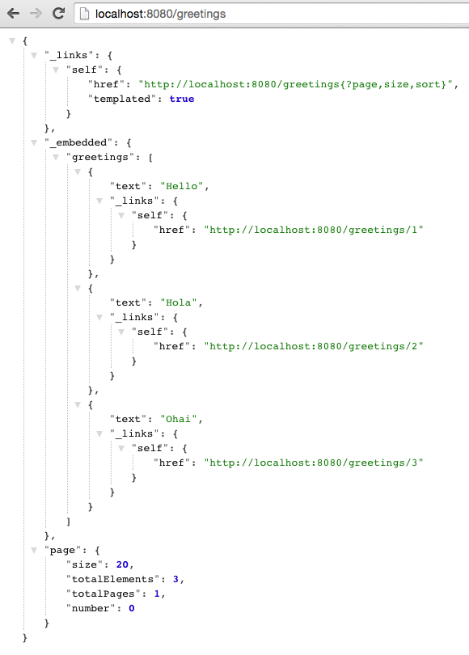

# Spring Boot With Spring Data Rest

<!-- TOC depth:6 withLinks:1 updateOnSave:1 orderedList:0 -->

- [Spring Boot With Spring Data Rest](#spring-boot-with-spring-data-rest)
	- [Requirements](#requirements)
	- [What You Will Learn](#what-you-will-learn)
	- [Exercises](#exercises)
		- [Add an Embedded Database](#add-an-embedded-database)
		- [Persistence With Spring Data JPA](#persistence-with-spring-data-jpa)
		- [Add a Restful API with Spring Data Rest](#add-a-restful-api-with-spring-data-rest)
		- [How to Run Code on Startup](#how-to-run-code-on-startup)
		- [Turn Up Logging](#turn-up-logging)
		- [Run `hello-spring-boot-rest`](#run-hello-spring-boot-rest)
		- [Deploy to PCF with No Code Changes But Use MySQL](#deploy-to-pcf-with-no-code-changes-but-use-mysql)
<!-- /TOC -->

Estimated Time: 45 minutes

## Requirements

[Lab Requirements](../requirements.md)

## What You Will Learn

* How to use repositories for data access
* How to expose a REST API on top of those repositories
* How to use an embedded database for development
* How to use a production ready database in production
* How to gain access to the command line arguments and run specific code once
* How to control log levels

## Exercises

### Add an Embedded Database

1) Review the following file: `$CLOUD_NATIVE_APP_LABS_HOME/hello-spring-boot-rest/pom.xml`.  By adding the `hsqldb` dependency, we have added embedded database support for the `hello-spring-boot-rest` application.  This helps us get started quickly in development, as we don't have to provision a database.

```xml
<dependency>
	<groupId>org.hsqldb</groupId>
	<artifactId>hsqldb</artifactId>
	<scope>runtime</scope>
</dependency>
```

### Persistence With Spring Data JPA

1) Review the following file: `$CLOUD_NATIVE_APP_LABS_HOME/hello-spring-boot-rest/pom.xml`.  By adding the `spring-boot-starter-data-jpa` dependency, we have added Spring Data JPA support for the `hello-spring-boot-rest` application.

Implementing a data access layer of an application has been cumbersome for quite a while. Too much boilerplate code has to be written to execute simple queries as well as perform pagination, and auditing. Spring Data JPA aims to significantly improve the implementation of data access layers by reducing the effort to the amount that's actually needed. As a developer you write your repository interfaces, including custom finder methods, and Spring will provide the implementation automatically.

To read more on Spring Data JPA go [here](http://docs.spring.io/spring-data/jpa/docs/1.9.0.RELEASE/reference/html/).

```xml
<dependency>
	<groupId>org.springframework.boot</groupId>
	<artifactId>spring-boot-starter-data-jpa</artifactId>
</dependency>
```

2) Review the following file: `$CLOUD_NATIVE_APP_LABS_HOME/hello-spring-boot-rest/src/main/java/io/pivotal/hello/Greeting.java`.  This is a typical JPA domain (`Entity`) class.  This class represents one row in our `greeting` table.

```java
@Entity
public class Greeting {

	@Id
	private Integer id;

	private String text;

	public Greeting(Integer id, String text) {
		super();
		this.id = id;
		this.text = text;
	}

	@Override
	public String toString() {
		return "Greeting [id=" + id + ", text=" + text + "]";
	}

	public Integer getId() {
		return id;
	}

	public String getText() {
		return text;
	}

	public Greeting() {

	}

}
```

3) Review the following file: `$CLOUD_NATIVE_APP_LABS_HOME/hello-spring-boot-rest/src/main/java/io/pivotal/hello/GreetingRepository.java`.  This repository interface provides [CRUD operations](http://docs.spring.io/spring-data/jpa/docs/current/api/org/springframework/data/jpa/repository/JpaRepository.html) against the `greeting` table.  All without the developer having to write any implementation!

```java
public interface GreetingRepository extends JpaRepository<Greeting, Long>{

}
```

4) Review the following file: `$CLOUD_NATIVE_APP_LABS_HOME/hello-spring-boot-rest/src/main/resources/application.yml`.  The `spring.jpa.hibernate.ddl-auto` setting controls how/if DDL changes are made.  In this case, our application will update the schema if needed on startup.  Read more on database initialization [here](http://docs.spring.io/spring-boot/docs/current/reference/html/howto-database-initialization.html).


```yml
spring:
  jpa:
    hibernate:
      ddl-auto: update
```

### Add a Restful API with Spring Data Rest

1) Review the following file: `$CLOUD_NATIVE_APP_LABS_HOME/hello-spring-boot-rest/pom.xml`.  By adding the `spring-boot-starter-data-rest` dependency, we have added REST support for our JPA repositories in the `hello-spring-boot-rest` application.

```xml
<dependency>
	<groupId>org.springframework.boot</groupId>
	<artifactId>spring-boot-starter-data-rest</artifactId>
</dependency>
```

The goal of the Spring Data REST project is to provide a solid foundation on which to expose CRUD operations to your repositories using plain HTTP REST semantics.  Read more on Spring Data REST [here](http://docs.spring.io/spring-data/rest/docs/2.4.0.RELEASE/reference/html/).

For the `GreetingRepository`, Spring Data REST exposes a collection resource at `/greetings`. The path is derived from the uncapitalized, pluralized, simple class name of the domain class being managed. It also exposes an item resource for each of the items managed by the repository under the URI template `/greetings/{id}`.

We will explore the REST API, once we populate the database.

### How to Run Code on Startup

In many cases, you need to run some code on startup.  Spring Boot allows you capture the command line arguments and run code just as if you had implemented `public static void main(String[] args)` by implementing a `CommandLineRunner` bean.

`CommandLineRunner` is a core feature to Spring Boot so there are no dependencies that need to be explicitly added.

1) Review the following file: `$CLOUD_NATIVE_APP_LABS_HOME/hello-spring-boot-rest/src/main/java/io/pivotal/hello/HelloSpringBootApplication.java`.


```java
@SpringBootApplication
public class HelloSpringBootApplication {

	Logger logger = LoggerFactory
			.getLogger(HelloSpringBootApplication.class);

	public static void main(String[] args) {
		SpringApplication.run(HelloSpringBootApplication.class, args);
	}

	/**
	 *
	 * Loads the database on startup
	 *
	 * @param gr
	 * @return
	 */
	@Bean
	CommandLineRunner loadDatabase(GreetingRepository gr) {
		return args -> {
			logger.debug("loading database..");
			gr.save(new Greeting(1, "Hello"));
			gr.save(new Greeting(2, "Hola"));
			gr.save(new Greeting(3, "Ohai"));
			logger.debug("record count: {}", gr.count());
			gr.findAll().forEach(x -> logger.debug(x.toString()));
		};

	}

}

```

In this case, we are using a `CommandLineRunner` to populate the database with our `GreetingRepository`.  

### Turn Up Logging

To view the debug statements in the class we can turn up logging.

1) Review the following file: `$CLOUD_NATIVE_APP_LABS_HOME/hello-spring-boot-rest/src/main/resources/application.yml`.

```yaml
logging:
  level:
    io:
      pivotal:DEBUG
```

Log levels can be  `ERROR`, `WARN`, `INFO`, `DEBUG` or `TRACE`.

Simply specify the package/class in the `logging.level` key and set the desired level.

In this case, we have turned on `DEBUG` logging for everything in the `io.pivotal` package.

### Run `hello-spring-boot-rest`

1) Open a terminal window.

```bash
$ cd $CLOUD_NATIVE_APP_LABS_HOME/hello-spring-boot-rest
$ mvn clean spring-boot:run
```

2) View the logs in the terminal output.  See the database being populated.

```
2015-10-06 13:42:27.350 DEBUG 65573 --- [lication.main()] i.p.hello.HelloSpringBootApplication     : loading database..
2015-10-06 13:42:27.527 DEBUG 65573 --- [lication.main()] i.p.hello.HelloSpringBootApplication     : record count: 3
2015-10-06 13:42:27.564 DEBUG 65573 --- [lication.main()] i.p.hello.HelloSpringBootApplication     : Greeting [id=1, text=Hello]
2015-10-06 13:42:27.564 DEBUG 65573 --- [lication.main()] i.p.hello.HelloSpringBootApplication     : Greeting [id=2, text=Hola]
2015-10-06 13:42:27.564 DEBUG 65573 --- [lication.main()] i.p.hello.HelloSpringBootApplication     : Greeting [id=3, text=Ohai]
```

3) Browse to [http://localhost:8080/greetings](http://localhost:8080/greetings)



Notice that not just data is returned but links on how to navigate the API.  This is provided [Spring HATEOAS](http://projects.spring.io/spring-hateoas/) as opposed to establishing a contract up front or use of documentation.  Read more on [HATEOUS](https://en.wikipedia.org/wiki/HATEOAS).

4) Experiment with paging and sorting

* Sort by text in ascending order: [http://localhost:8080/greetings?sort=text,asc](http://localhost:8080/greetings?sort=text,asc)
* Sort by text in decending order: [http://localhost:8080/greetings?sort=text,desc](http://localhost:8080/greetings?sort=text,desc)
* Get page 0, size 1: [http://localhost:8080/greetings?size=1&page=0](http://localhost:8080/greetings?size=1&page=0)
* Get page 1, size 1: [http://localhost:8080/greetings?size=1&page=1](http://localhost:8080/greetings?size=1&page=1)

5) Stop the `hello-spring-boot-rest` application.

### Deploy to PCF with No Code Changes But Use MySQL

We know that we don't want to use our embedded database when we deploy our application.  In this case, we plan to use MySql.

1) Review the following file: `$CLOUD_NATIVE_APP_LABS_HOME/hello-spring-boot-rest/pom.xml`.  By adding the `mysql-connector-java` dependency, we have added MySQL support for the `hello-spring-boot-rest` application.

```xml
<dependency>
	<groupId>mysql</groupId>
	<artifactId>mysql-connector-java</artifactId>
	<scope>runtime</scope>
</dependency>
```

2) Login the Pivotal Cloud Foundry installation. Your instructor will provide login information.

```
$ cf login
```

3) Create a MySQL service instance.

```
$ cf create-service p-mysql 100mb-dev greetings-db
```


4) Deploy your `hello-spring-boot-rest` application:

```bash
$ mvn clean package
$ cf push hello-spring-boot-rest -p target/hello-spring-boot-rest-0.0.1-SNAPSHOT.jar -m 512M --random-route --no-start
$ cf bind-service hello-spring-boot-rest greetings-db
$ cf start hello-spring-boot-rest
```
You can safely ignore the _TIP: Use 'cf restage' to ensure your env variable changes take effect message from the CLI._ We can just start the `hello-spring-boot-rest` application.

5) View the [URI of PCF app]/greetings endpoint to verify that the PCF application is working. The `hello-spring-boot-rest` application works the same as it did with an embedded database, but now it uses MySQL with no code changes.

***What Just Happened?***

When running locally Spring Boot will use the embedded database (`hsqldb`) and create the `DataSource` (how to connect to the database) for you.  The Cloud Foundry Java Buildpack will detect a database service binding and re-write the `DataSource` for you when you run in the cloud, so that you can connect to your bound service.  This part of the Java Buildpack is known as auto-reconfiguration.  More details can be found [here](https://github.com/cloudfoundry/java-buildpack-auto-reconfiguration).
