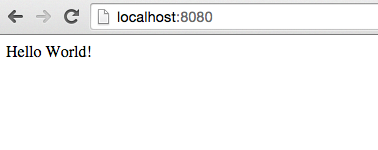
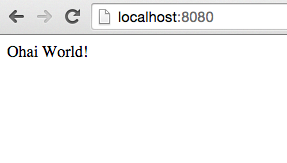
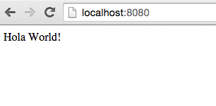

# Externalizing Configuration with Spring Boot

## Requirements

[Lab Requirements](../requirements.md)

## What You Will Learn

* How to externalize configuration in a Spring Boot project

Estimated time: 25 minutes

## Exercises

### Refactoring to Externalize the Config

1) Review the following file:`$CLOUD_NATIVE_APP_LABS_HOME/hello-spring-boot-external-config/src/main/resources/application.yml`.  We have refactored the `application.properties` to `application.yml`.

```yml
greeting: Hello
```

Spring Boot supports both configuration formats: traditional properties files and YAML.  YAML offers a conscise format when compared to properties files.  Additionally, support for multiple documents within one file add an added capability not present in properties files (more on this later in the lab).  For more details on externalizing configuration review the following [documentation](http://docs.spring.io/spring-boot/docs/current/reference/html/boot-features-external-config.html).


2) Review the following file:`$CLOUD_NATIVE_APP_LABS_HOME/hello-spring-boot-external-config/src/main/java/io/pivotal/hello/HelloSpringBootApplication.java`.

```java
@SpringBootApplication
@RestController
public class HelloSpringBootApplication {

	@Value("${greeting}")
	String greeting;

    public static void main(String[] args) {
        SpringApplication.run(HelloSpringBootApplication.class, args);
    }

    @RequestMapping("/")
    public String hello() {
        return String.format("%s World!", greeting);
    }
}
```

We have refactored the class to inject the greeting:

```java
@Value("${greeting}")
String greeting;
```

We have also refactored the `hello()` method to return the injected greeting:

```java
public String hello() {
		return String.format("%s World!", greeting);
}
```


3) Open a new terminal window.  Run the `hello-spring-boot-external-config` application:

``` bash
$ cd hello-spring-boot-external-config
$ mvn clean spring-boot:run
```

4) Visit the application in the browser [http://localhost:8080](http://localhost:8080), and verify that the output is still the following:



5) Stop the `hello-spring-boot-external-config` application.

### Using Environment Variables for Config

1) Run the application again, this time setting the `GREETING` environment variable:

```bash
[mac, linux]
$ GREETING=Ohai mvn clean spring-boot:run

[windows]
$ set GREETING=Ohai
$ mvn clean spring-boot:run
```

2) Visit the application in the browser [http://localhost:8080](http://localhost:8080), and verify that the output has changed to the following:



***What Just Happened?***

Instead of returning the `greeting` value from the `application.yml`, the value from the environment variable was used.  The environment variable overrides the value from the `application.yml` file.

3) Stop the `hello-spring-boot-external-config` application.

### Using Spring Profiles for Config

1) Add a spanish profile to the `$CLOUD_NATIVE_APP_LABS_HOME/hello-spring-boot-external-config/src/main/resources/application.yml`. Your finished configuration should reflect the following.  _You must edit the file._

```yml
greeting: Hello

---

spring:
  profiles: spanish

greeting: Hola
```

Yaml supports having multiple documents in one file.  The first document is the default configuration.  In the second document, we  use the `spring.profiles` key to indicate when it applies.  When running with the spanish profile, use "Hola" as the greeting.


2) Run the `hello-spring-boot-external-config` application.  This time setting the `SPRING_PROFILES_ACTIVE` environment variable:

```bash
[mac, linux]
$ SPRING_PROFILES_ACTIVE=spanish mvn clean spring-boot:run

[windows]
#remove GREETING env variable
$ set GREETING=
$ set SPRING_PROFILES_ACTIVE=spanish
$ mvn clean spring-boot:run
```

3) Visit the application in the browser [http://localhost:8080](http://localhost:8080), and verify that the output has changed to the following:



***What Just Happened?***

The value for the `greeting` key was pulled from the the spanish profile yaml document, because the spanish profile is active.

4) Stop the `hello-spring-boot-external-config` application.

### Resolving Conflicts

1) Run the `hello-spring-boot-external-config` application, this time setting both the `SPRING_PROFILES_ACTIVE` and `GREETING` environment variables:

```
[mac, linux]
$ SPRING_PROFILES_ACTIVE=spanish GREETING=Ohai mvn clean spring-boot:run

[windows]
$ set SPRING_PROFILES_ACTIVE=spanish
$ set GREETING=Ohai
$ mvn clean spring-boot:run
```

Visit the application in the browser [http://localhost:8080](http://localhost:8080), and verify that the output has changed to the following:


2) Stop the `hello-spring-boot-external-config` application.

***What Just Happened?***

Instead of returning either `greeting` value from the `application.yml`, the value from the environment variable was used.  It overrides the active profile (`SPRING_PROFILES_ACTIVE`).

Visit http://docs.spring.io/spring-boot/docs/current/reference/html/boot-features-external-config.html to learn more about this outcome and the entire priority scheme for conflict resolution.
