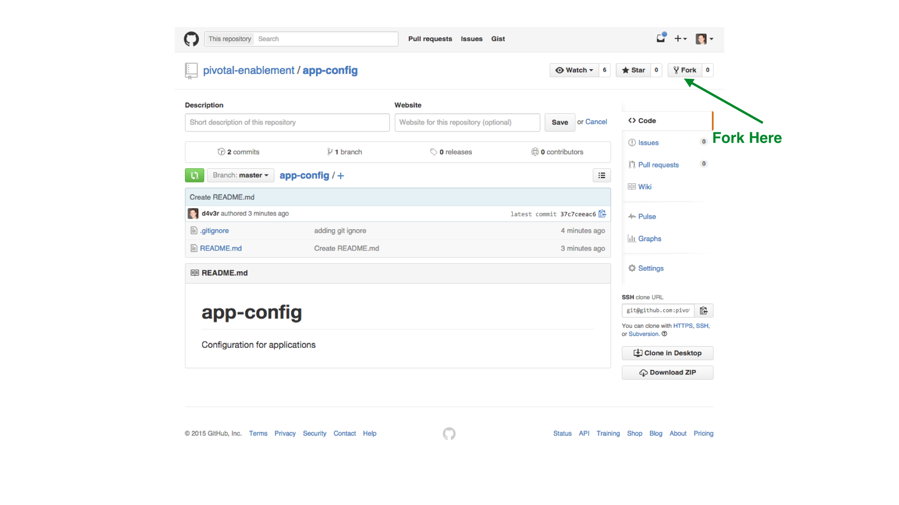
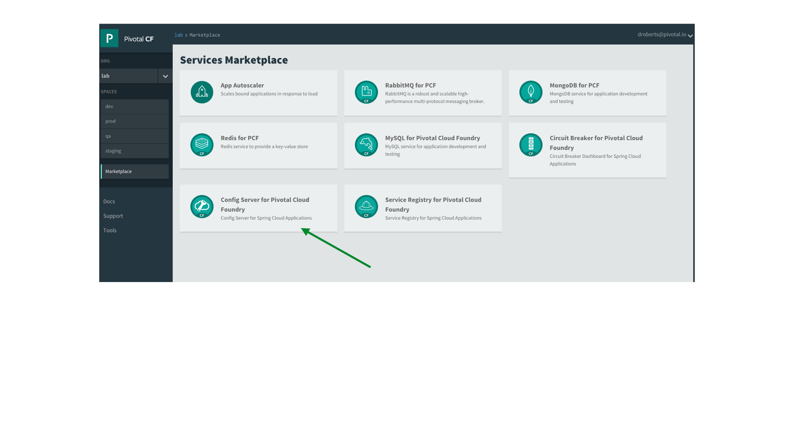
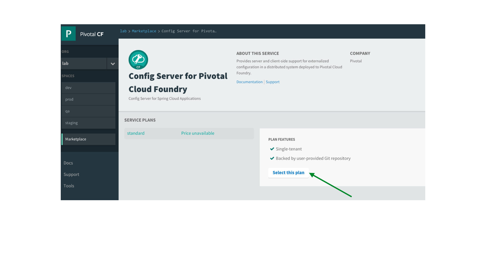
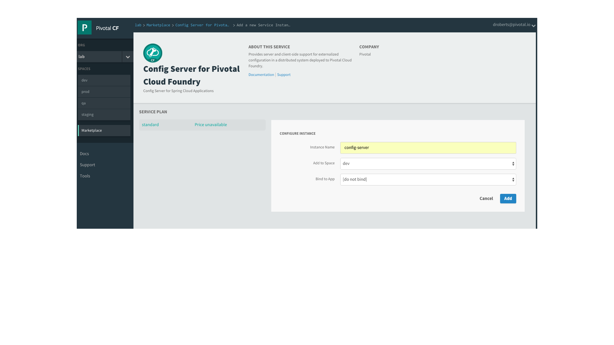
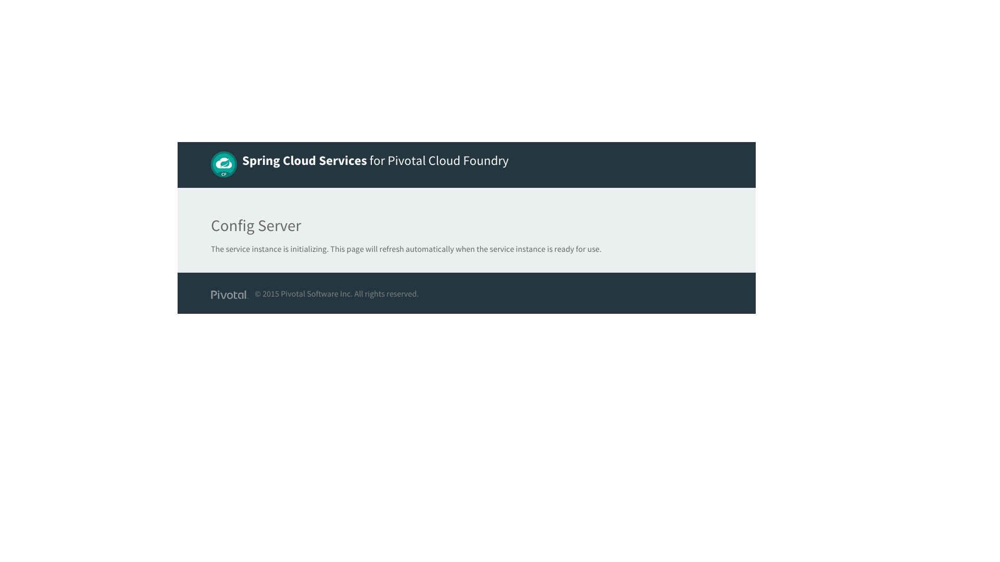
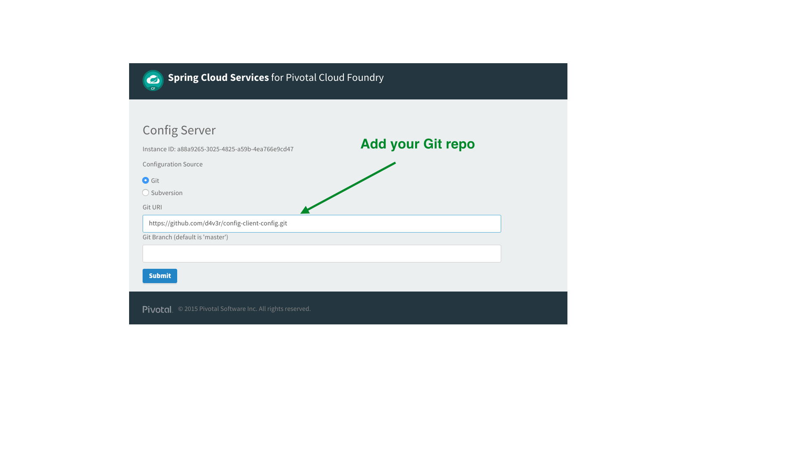

# Spring Cloud Config Client

## Requirements

1. Installation of [Maven](https://maven.apache.org/)

2. Installation and experience with [git](https://git-scm.com/) and [github](https://github.com/)

3. Experience with [Spring](https://spring.io/)


## Exercises

1. Clone the application repo

 ```
$ cd ~
$ clone https://github.com/pivotal-enablement/config-client.git
```

1. Fork the configuration repo to your account.


1. Clone the fork you just created

 ```
$ cd ~
$ clone <Your fork of the config-client-config repo>
```
1. Locate the Config Server in the marketplace


1. Select the default plan


1. Create a service instance


1. Go to Manage the service instance.

1. After creating the Config Server it takes ~1 minute initialize.


1. Link the Config Server to your fork of the `config-client-config` repo


1. Deploy the `config-client` app

 ```
$ cd config-client
$ mvn package
$ cf push config-client -p target/config-client-0.0.1-SNAPSHOT.jar
```
1. Bind the `config-server` service to the `config-client` app
```
$ cf bind-service config-client config-server
$ cf restage config-client
```
