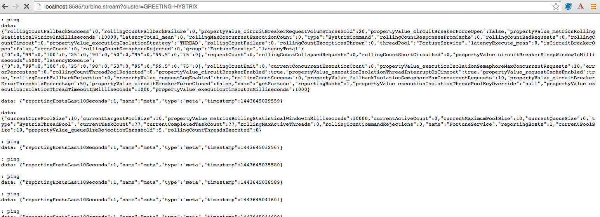

# Spring Cloud Netflix: Circuit Breaking Metric Aggregation

<!-- TOC depth:6 withLinks:1 updateOnSave:1 orderedList:0 -->

- [Spring Cloud Netflix: Circuit Breaking Metric Aggregation](#spring-cloud-netflix-circuit-breaking-metric-aggregation)
	- [Requirements](#requirements)
	- [What You Will Learn](#what-you-will-learn)
	- [Exercises](#exercises)
		- [Start the  `config-server`,  `service-registry`, `fortune-service`, `greeting-hystrix`, and `hystrix-dashboard`](#start-the-config-server-service-registry-fortune-service-greeting-hystrix-and-hystrix-dashboard)
		- [Set up `turbine`](#set-up-turbine)
		- [Deploying to PCF](#deploying-to-pcf)
		- [Deploy `greeting-hystrix` to PCF](#deploy-greeting-hystrix-to-pcf)
		- [Deploy `turbine-amqp` to PCF](#deploy-turbine-amqp-to-pcf)
		- [Deploy `hystrix-dashboard` to PCF](#deploy-hystrix-dashboard-to-pcf)
<!-- /TOC -->

Estimated Time: 25 minutes

## Requirements

[Lab Requirements](../requirements.md)

## What You Will Learn


* How to aggregate multiple metric streams with `turbine`
* How to use Turbine in Pivotal Cloud Foundry


## Exercises


### Start the  `config-server`,  `service-registry`, `fortune-service`, `greeting-hystrix`, and `hystrix-dashboard` applications

1) Start the `config-server` in a terminal window.  You may have terminal windows still open from previous labs.  They may be reused for this lab.

```bash
$ cd $CLOUD_NATIVE_APP_LABS_HOME/config-server
$ mvn clean spring-boot:run
```

2) Start the `service-registry`

```bash
$ cd $CLOUD_NATIVE_APP_LABS_HOME/service-registry
$ mvn clean spring-boot:run
```

3) Start the `fortune-service`

```bash
$ cd $CLOUD_NATIVE_APP_LABS_HOME/fortune-service
$ mvn clean spring-boot:run
```

4) Start the `greeting-hystrix`

```bash
$ cd $CLOUD_NATIVE_APP_LABS_HOME/greeting-hystrix
$ mvn clean spring-boot:run
```

5) Start the `hystrix-dashboard`

```bash
$ cd $CLOUD_NATIVE_APP_LABS_HOME/hystrix-dashboard
$ mvn clean spring-boot:run
```

Allow a few moments for `greeting-hystrix` and `fortune-service` to register with the `service-registry`.

### Set up `turbine`

Looking at individual application instances in the Hystrix Dashboard is not very useful in terms of understanding the overall health of the system. Turbine is an application that aggregates all of the relevant `/hystrix.stream` endpoints into a combined `/turbine.stream` for use in the Hystrix Dashboard.

1) Review the `$CLOUD_NATIVE_APP_LABS_HOME/turbine/pom.xml` file.  By adding `spring-cloud-starter-turbine` to the classpath this application is eligible to aggregate metrics via Turbine.

```xml
<dependency>
    <groupId>org.springframework.cloud</groupId>
    <artifactId>spring-cloud-starter-turbine</artifactId>
</dependency>
```

2) Review the following file: `$CLOUD_NATIVE_APP_LABS_HOME/turbine/src/main/java/io/pivotal/TurbineApplication.java`.  Note the use of the `@EnableTurbine` annotation. This creates a turbine application.

```java
@SpringBootApplication
@EnableTurbine
public class TurbineApplication {


    public static void main(String[] args) {
        SpringApplication.run(TurbineApplication.class, args);
    }

}
```

3). Review the following file: `$CLOUD_NATIVE_APP_LABS_HOME/turbine/src/main/resources/bootstrap.yml`.  `turbine.appConfig` is a list of Eureka `serviceIds` that Turbine will use to lookup instances.  `turbine.aggregator.clusterConfig` is the Turbine cluster these services belong to (how they will be grouped).

```yml
spring:
  application:
    name: turbine
  cloud:
    config:
      uri: ${vcap.services.config-server.credentials.uri:http://localhost:8888}
turbine:
  aggregator:
    clusterConfig: GREETING-HYSTRIX
  appConfig: greeting-hystrix
```

4) Open a new terminal window. Start the `turbine` app

```bash
$ cd $CLOUD_NATIVE_APP_LABS_HOME/turbine
$ mvn clean spring-boot:run
```

5) Wait for the `turbine` application to register with [`service-registry`](http://localhost:8761/).

6) View the turbine stream in a browser [http://localhost:8585/turbine.stream?cluster=GREETING-HYSTRIX](http://localhost:8585/turbine.stream?cluster=GREETING-HYSTRIX)


7) Configure the [`hystrix-dashboard`](http://localhost:8686/hystrix) to consume the turbine stream.  Enter `http://localhost:8585/turbine.stream?cluster=GREETING-HYSTRIX`

8) Experiment! Refresh the `greeting-hystrix` `/` endpoint several times.  Take down the `fortune-service` app.  What does the dashboard do?

9) When done, stop the `config-server`, `service-registry`, `fortune-service`, `greeting-hystrix`, `hystrix-dashboard` and `turbine` applications.

***What Just Happened?***

Turbine discovered the `greeting-hystrix` application through the `service-registry` application.  Turbine then consumed the `/hystrix.stream` and rolled that up into an aggregate `/turbine.stream`.  Therefore, if we had multiple `greeting-hystrix` applications running all the metrics could be consumed from this single endpoint (`/turbine.stream`)

### Deploying to PCF

In PCF, the traditional Turbine model of pulling metrics from all the distributed Hystrix enabled applications doesn’t work.  This is because every application has the same `hostname` (every app instance has the same URL for a given app).  The problem is solved with Turbine AMQP.  Metrics are published through a message broker.  We'll use RabbitMQ.


### Deploy `greeting-hystrix` to PCF

1) Add the following dependency to the $CLOUD_NATIVE_APP_LABS_HOME/greeting-hystrix/pom.xml file. _You must edit the file._

```xml
<dependency>
    <groupId>org.springframework.cloud</groupId>
    <artifactId>spring-cloud-netflix-hystrix-amqp</artifactId>
</dependency>
```

2) Create a RabbitMQ Service Instance on PCF

```bash
$ cf create-service p-rabbitmq standard turbine-broker
```


3) Package, push, bind services and set environment variables for `greeting-hystrix`.
```bash
$ mvn clean package
$ cf push greeting-hystrix -p target/greeting-hystrix-0.0.1-SNAPSHOT.jar -m 512M --random-route --no-start
$ cf bind-service greeting-hystrix config-server
$ cf bind-service greeting-hystrix turbine-broker
$ cf set-env greeting-hystrix SPRING_PROFILES_ACTIVE dev
$ cf start greeting-hystrix
```
You can safely ignore the _TIP: Use 'cf restage' to ensure your env variable changes take effect_ message from the CLI. We can just start the `greeting-hystrix` application.

### Deploy `turbine-amqp` to PCF

1) Review the `$CLOUD_NATIVE_APP_LABS_HOME/turbine-amqp/pom.xml` file.  By adding `spring-cloud-starter-turbine-amqp` to the classpath this application is eligible to use Turbine AMQP.

```xml
<dependency>
    <groupId>org.springframework.cloud</groupId>
    <artifactId>spring-cloud-starter-turbine-amqp</artifactId>
</dependency>
```

2) Review the following file: `$CLOUD_NATIVE_APP_LABS_HOME/turbine-amqp/src/main/java/io/pivotal/TurbineApplication.java`.  Note the use of the `@EnableTurbineAmqp` annotation. This creates a turbine application.  Turbine AMQP uses `com.netflix.turbine:turbine-core:2.0.0-DP.2` which leverages Netty, so we turn off our servlet container (Tomcat).

```java
@SpringBootApplication
@EnableTurbineAmqp
public class TurbineApplication {

    public static void main(String[] args) {
		new SpringApplicationBuilder(TurbineApplication.class).web(false).run(args);
	}


}
```

3). Review the following file: `$CLOUD_NATIVE_APP_LABS_HOME/turbine-amqp/src/main/resources/bootstrap.yml`.  `turbine.appConfig` and `turbine.aggregator.clusterConfig` no longer need to be configured.

```yml
spring:
  application:
    name: turbine-amqp
  cloud:
    config:
      uri: ${vcap.services.config-server.credentials.uri:http://localhost:8888}
```


4) Package, push and bind services for `turbine-amqp`
```bash
$ mvn clean package
$ cf push turbine-amqp -p target/turbine-amqp-0.0.1-SNAPSHOT.jar --random-route -m 512M --no-start
$ cf bind-service turbine-amqp turbine-broker
$ cf start turbine-amqp
```
You can safely ignore the _TIP: Use 'cf restage' to ensure your env variable changes take effect message from the CLI._ We can just start the `turbine-amqp` application.

### Deploy `hystrix-dashboard` to PCF

1) Package, and push `hystrix-dashboard`
```bash
$ mvn clean package
$ cf push hystrix-dashboard -p target/hystrix-dashboard-0.0.1-SNAPSHOT.jar -m 512M --random-route
```

2) Configure the `hystrix-dashboard` (i.e `http://your-hystrix-url/hystrix`) to consume the turbine stream.  Enter your `turbine-amqp` URL.

3) Experiment! Refresh the `greeting-hystrix` `/` endpoint several times.  Take down the `fortune-service` app.  Scale the `greeting-hystrix` app.  What does the dashboard do?
