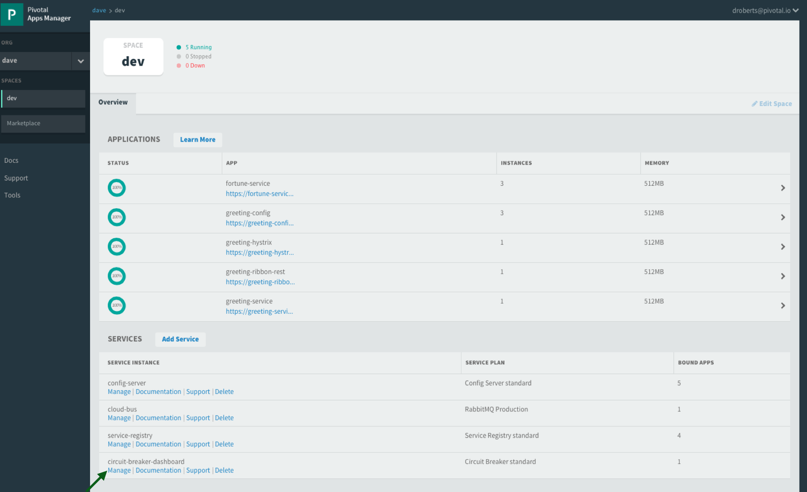

# Spring Cloud Netflix: Circuit Breaking Metric Aggregation

<!-- TOC depth:6 withLinks:1 updateOnSave:1 orderedList:0 -->

- [Spring Cloud Netflix: Circuit Breaking Metric Aggregation](#spring-cloud-netflix-circuit-breaking-metric-aggregation)
	- [Requirements](#requirements)
	- [What You Will Learn](#what-you-will-learn)
	- [Exercises](#exercises)
		- [Start the  `config-server`,  `service-registry`, `fortune-service`, `greeting-hystrix`, and `hystrix-dashboard` applications](#start-the-config-server-service-registry-fortune-service-greeting-hystrix-and-hystrix-dashboard-applications)
		- [Set up `turbine`](#set-up-turbine)
		- [Deploying to PCF](#deploying-to-pcf)
		- [Deploy `greeting-hystrix` to PCF](#deploy-greeting-hystrix-to-pcf)
<!-- /TOC -->

Estimated Time: 25 minutes

## Requirements

[Lab Requirements](../requirements.md)

## What You Will Learn


* How to aggregate multiple metric streams with `turbine`
* How to use Turbine in Pivotal Cloud Foundry


## Exercises


### Start the  `config-server`,  `service-registry`, `fortune-service`, `greeting-hystrix`, and `hystrix-dashboard` applications

1) Start the `config-server` in a terminal window.  You may have terminal windows still open from previous labs.  They may be reused for this lab.

```bash
$ cd $SPRING_CLOUD_SERVICES_LABS_HOME/config-server
$ mvn clean spring-boot:run
```

2) Start the `service-registry`

```bash
$ cd $SPRING_CLOUD_SERVICES_LABS_HOME/service-registry
$ mvn clean spring-boot:run
```

3) Start the `fortune-service`

```bash
$ cd $SPRING_CLOUD_SERVICES_LABS_HOME/fortune-service
$ mvn clean spring-boot:run
```

4) Start the `greeting-hystrix`

```bash
$ cd $SPRING_CLOUD_SERVICES_LABS_HOME/greeting-hystrix
$ mvn clean spring-boot:run
```

5) Start the `hystrix-dashboard`

```bash
$ cd $SPRING_CLOUD_SERVICES_LABS_HOME/hystrix-dashboard
$ mvn clean spring-boot:run
```

Allow a few moments for `greeting-hystrix` and `fortune-service` to register with the `service-registry`.

### Set up `turbine`

Looking at individual application instances in the Hystrix Dashboard is not very useful in terms of understanding the overall health of the system. Turbine is an application that aggregates all of the relevant `/hystrix.stream` endpoints into a combined `/turbine.stream` for use in the Hystrix Dashboard.

1) Review the `$SPRING_CLOUD_SERVICES_LABS_HOME/turbine/pom.xml` file.  By adding `spring-cloud-starter-turbine` to the classpath this application is eligible to aggregate metrics via Turbine.

```xml
<dependency>
    <groupId>org.springframework.cloud</groupId>
    <artifactId>spring-cloud-starter-turbine</artifactId>
</dependency>
```

2) Review the following file: `$SPRING_CLOUD_SERVICES_LABS_HOME/turbine/src/main/java/io/pivotal/TurbineApplication.java`.  Note the use of the `@EnableTurbine` annotation. This creates a turbine application.

```java
@SpringBootApplication
@EnableTurbine
public class TurbineApplication {


    public static void main(String[] args) {
        SpringApplication.run(TurbineApplication.class, args);
    }

}
```

3). Review the following file: `$SPRING_CLOUD_SERVICES_LABS_HOME/turbine/src/main/resources/bootstrap.yml`.  `turbine.appConfig` is a list of Eureka `serviceIds` that Turbine will use to lookup instances.  `turbine.aggregator.clusterConfig` is the Turbine cluster these services belong to (how they will be grouped).

```yml
spring:
  application:
    name: turbine
turbine:
  aggregator:
    clusterConfig: GREETING-HYSTRIX
  appConfig: greeting-hystrix
```

4) Open a new terminal window. Start the `turbine` app

```bash
$ cd $SPRING_CLOUD_SERVICES_LABS_HOME/turbine
$ mvn clean spring-boot:run
```

5) Wait for the `turbine` application to register with [`service-registry`](http://localhost:8761/).

6) View the turbine stream in a browser [http://localhost:8585/turbine.stream?cluster=GREETING-HYSTRIX](http://localhost:8585/turbine.stream?cluster=GREETING-HYSTRIX)


7) Configure the [`hystrix-dashboard`](http://localhost:8686/hystrix) to consume the turbine stream.  Enter `http://localhost:8585/turbine.stream?cluster=GREETING-HYSTRIX`

8) Experiment! Refresh the `greeting-hystrix` `/` endpoint several times.  Take down the `fortune-service` app.  What does the dashboard do?

9) When done, stop the `config-server`, `service-registry`, `fortune-service`, `greeting-hystrix`, `hystrix-dashboard` and `turbine` applications.

***What Just Happened?***

Turbine discovered the `greeting-hystrix` application through the `service-registry` application.  Turbine then consumed the `/hystrix.stream` and rolled that up into an aggregate `/turbine.stream`.  Therefore, if we had multiple `greeting-hystrix` applications running all the metrics could be consumed from this single endpoint (`/turbine.stream`)

### Deploying to PCF

In PCF, the traditional Turbine model of pulling metrics from all the distributed Hystrix enabled applications via HTTP doesn’t work when using the `route` registrationMethod.  Read [here](http://docs.pivotal.io/spring-cloud-services/service-registry/registering-a-service.html) for more details on registration methods.

When applications register using the `route` method every application has the same `hostname` (every app instance has the same URL for a given app).  Therefore it is unknown from Turbine perspective if all metrics are properly being collected.  The problem is solved with Turbine AMQP.  Metrics are published through a message broker.  We'll use RabbitMQ.


### Deploy `greeting-hystrix` to PCF

1) Create a Circuit Breaker Dashboard Service Instance

```bash
$ cf create-service p-circuit-breaker-dashboard standard circuit-breaker-dashboard
```
When creating a Circuit Breaker Service instance there are three items that get provisioned:

1. Hystrix Dashboard application instance
1. Turbine AMQP application instance
1. RabbitMQ Service Instance

This process takes some time and won't be immediately available for binding.  Give it a couple of minutes.

Click on the ***Manage*** link for the `circuit-breaker-dashboard` service instance to determine when the `circuit-breaker-dashboard` service instance is ready.


2) Package and push the `greeting-hystrix` application.
```bash
$ mvn clean package
$ cf push greeting-hystrix -p target/greeting-hystrix-0.0.1-SNAPSHOT.jar -m 512M --random-route --no-start
```

3) Bind services for the `greeting-hystrix`.

```bash
$ cf bind-service greeting-hystrix config-server
$ cf bind-service greeting-hystrix service-registry
$ cf bind-service greeting-hystrix circuit-breaker-dashboard
```
You can safely ignore the _TIP: Use 'cf restage' to ensure your env variable changes take effect_ message from the CLI.  We don't need to restage at this time.

4) If using self signed certificates, set the `CF_TARGET` environment variable for the `greeting-hystrix` application.

```bash
$ cf set-env greeting-hystrix CF_TARGET <your api endpoint - make sure it starts with "https://">
```

You can safely ignore the _TIP: Use 'cf restage' to ensure your env variable changes take effect_ message from the CLI.  We don't need to restage at this time.


5) Start the `greeting-hystrix` app.

```bash
$ cf start greeting-hystrix
```

6) Experiment! Refresh the `greeting-hystrix` / endpoint several times. Take down the fortune-service app. Scale the greeting-hystrix app. What does the dashboard do?

***What Just Happened?***

The `greeting-hystrix` application is publishing metrics via AMQP to RabbitMQ (this can be discovered by looking at `VCAP_SERVICES`).  Those metrics are then consumed and aggregated by Turbine.  The Circuit Breaker Dashboard then consumes the Turbine endpoint.  All of this detail has been abstracted away by using the PCF Circuit Breaker Dashboard Service.
