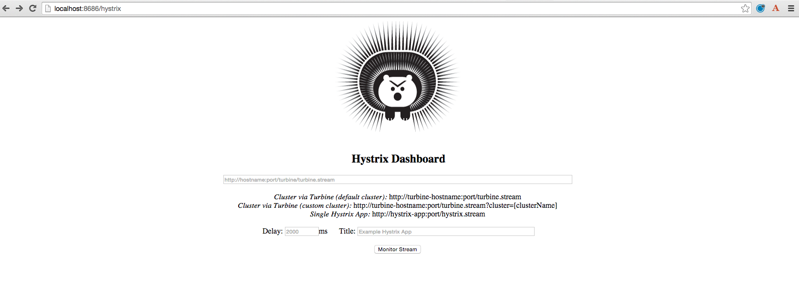
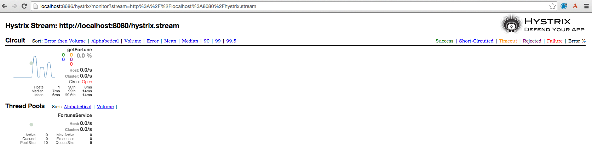

# Spring Cloud Netflix: Circuit Breaking

<!-- TOC depth:6 withLinks:1 updateOnSave:1 orderedList:0 -->

- [Spring Cloud Netflix: Circuit Breaking](#spring-cloud-netflix-circuit-breaking)
	- [Requirements](#requirements)
	- [What You Will Learn](#what-you-will-learn)
	- [Exercises](#exercises)
		- [Start the  `config-server`,  `service-registry`, and `fortune-service`](#start-the-config-server-service-registry-and-fortune-service)
		- [Set up `greeting-hystrix`](#set-up-greeting-hystrix)
		- [Set up the `greeting-hystrix` metric stream](#set-up-the-greeting-hystrix-metric-stream)
		- [Set up `hystrix-dashboard`](#set-up-hystrix-dashboard)
<!-- /TOC -->

Estimated Time: 25 minutes

## Requirements

[Lab Requirements](../requirements.md)

## What You Will Learn

* How to protect your application (`greeting-hystrix`) from failures or latency with the circuit breaking pattern
* How to publish circuit-breaking metrics from your application (`greeting-hystrix`)
* How to consume metric streams with the `hystrix-dashboard`


## Exercises


### Start the  `config-server`,  `service-registry`, and `fortune-service`

1) Start the `config-server` in a terminal window.  You may have terminal windows still open from previous labs.  They may be reused for this lab.

```bash
$ cd $CLOUD_NATIVE_APP_LABS_HOME/config-server
$ mvn clean spring-boot:run
```

2) Start the `service-registry`

```bash
$ cd $CLOUD_NATIVE_APP_LABS_HOME/service-registry
$ mvn clean spring-boot:run
```

3) Start the `fortune-service`

```bash
$ cd $CLOUD_NATIVE_APP_LABS_HOME/fortune-service
$ mvn clean spring-boot:run
```


### Set up `greeting-hystrix`

1) Review the `$CLOUD_NATIVE_APP_LABS_HOME/greeting-hystrix/pom.xml` file.  By adding `spring-cloud-starter-hystrix` to the classpath this application is eligible to use circuit breakers via Hystrix.

```xml
<dependency>
    <groupId>org.springframework.cloud</groupId>
    <artifactId>spring-cloud-starter-hystrix</artifactId>
</dependency>
```

2) Review the following file: `$CLOUD_NATIVE_APP_LABS_HOME/greeting-hystrix/src/main/java/io/pivotal/GreetingHystrixApplication.java`.  Note the use of the `@EnableCircuitBreaker` annotation. This allows the application to create circuit breakers.

```java
@SpringBootApplication
@EnableDiscoveryClient
@EnableCircuitBreaker
public class GreetingHystrixApplication {


    public static void main(String[] args) {
        SpringApplication.run(GreetingHystrixApplication.class, args);
    }

}
```

3). Review the following file: `$CLOUD_NATIVE_APP_LABS_HOME/greeting-hystrix/src/main/java/io/pivotal/fortune/FortuneService.java`.  Note the use of the `@HystrixCommand`.  This is our circuit breaker.  If `getFortune()` fails, a fallback method `defaultFortune` will be invoked.

```java
@Service
public class FortuneService {

	Logger logger = LoggerFactory
			.getLogger(FortuneService.class);

	@Autowired
	@LoadBalanced
	private RestTemplate restTemplate;

	@HystrixCommand(fallbackMethod = "defaultFortune")
	public String getFortune() {
    String fortune = restTemplate.getForObject("http://fortune-service", String.class);
		return fortune;
	}

	public String defaultFortune(){
		logger.debug("Default fortune used.");
		return "This fortune is no good. Try another.";
	}


}

```

4) Open a new terminal window. Start the `greeting-hystrix`

```bash
$ cd $CLOUD_NATIVE_APP_LABS_HOME/greeting-hystrix
$ mvn clean spring-boot:run
```

5) Refresh the `greeting-hystrix` `/` endpoint.  You should get fortunes from the `fortune-service`.

6) Stop the `fortune-service`.  And refresh the `greeting-hystrix` `/` endpoint again.  The default fortune is given.

7) Restart the `fortune-service`.  And refresh the `greeting-hystrix` `/` endpoint again.  After some time, fortunes from the `fortune-service` are back.

***What Just Happened?***

The circuit breaker tripped because the `fortune-service` was not available.  This insulates the `greeting-hystrix` application so that our users have a better user experience.

### Set up the `greeting-hystrix` metric stream

Being able to monitor the state of our circuit breakers is highly valuable, but first the `greeting-hystrix` application must expose the metrics.

This is accomplished by including the `actuator` dependency in the `greeting-hystrix` `pom.xml`.

1) Review the `$CLOUD_NATIVE_APP_LABS_HOME/greeting-hystrix/pom.xml` file.  By adding `spring-boot-starter-actuator` to the classpath this application will publish metrics at the `/hystrix.stream` endpoint.

```xml
<dependency>
	<groupId>org.springframework.boot</groupId>
	<artifactId>spring-boot-starter-actuator</artifactId>
</dependency>
```

2) Browse to [http://localhost:8080/hystrix.stream](http://localhost:8080/hystrix.stream) to review the metric stream.


### Set up `hystrix-dashboard`

Consuming the metric stream is difficult to interpret on our own.  The metric stream can be visualized with the Hystrix Dashboard.

1) Review the `$CLOUD_NATIVE_APP_LABS_HOME/hystrix-dashboard/pom.xml` file.  By adding `spring-cloud-starter-hystrix-dashboard` to the classpath this application is exposes a Hystrix Dashboard.

```xml
<dependency>
    <groupId>org.springframework.cloud</groupId>
    <artifactId>spring-cloud-starter-hystrix-dashboard</artifactId>
</dependency>
```

2) Review the following file: `$CLOUD_NATIVE_APP_LABS_HOME/hystrix-dashboard/src/main/java/io/pivotal/HystrixDashboardApplication.java`.  Note the use of the `@EnableHystrixDashboard` annotation. This creates a Hystrix Dashboard.

```java
@SpringBootApplication
@EnableHystrixDashboard
public class HystrixDashboardApplication {

    public static void main(String[] args) {
        SpringApplication.run(HystrixDashboardApplication.class, args);
    }
}
```

3) Open a new terminal window. Start the `hystrix-dashboard`

```bash
$ cd $CLOUD_NATIVE_APP_LABS_HOME/hystrix-dashboard
$ mvn clean spring-boot:run
```

4) Open a browser to [http://localhost:8686/hystrix](http://localhost:8686/hystrix)


5) Link the `hystrix-dashboard` to the `greeting-hystrix` app.  Enter `http://localhost:8080/hystrix.stream` as the stream to monitor.

6) Experiment! Refresh the `greeting-hystrix` `/` endpoint several times.  Take down the `fortune-service` app.  What does the dashboard do?  Review the [dashboard doc](https://github.com/Netflix/Hystrix/wiki/Dashboard) for an explanation on metrics.


