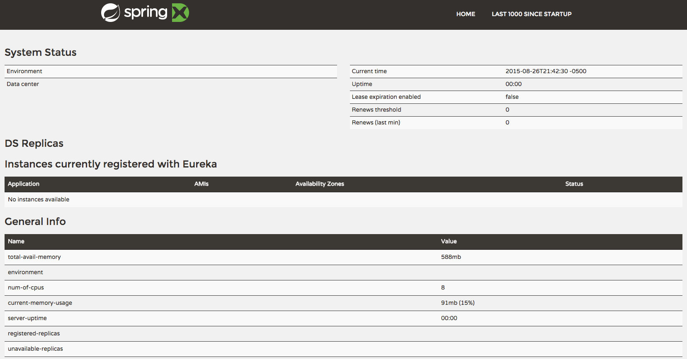
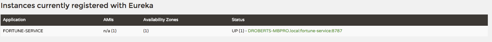
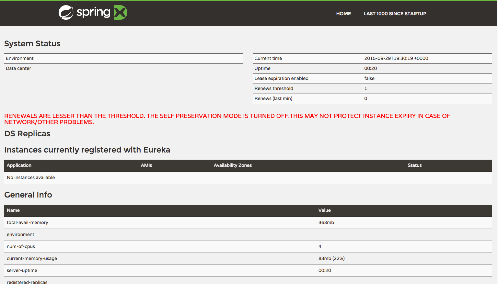
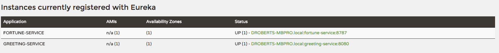
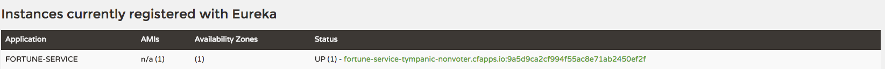
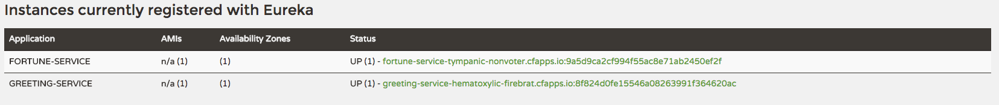

# Spring Cloud Netflix: Service Discovery

<!-- TOC depth:6 withLinks:1 updateOnSave:1 orderedList:0 -->

- [Spring Cloud Netflix: Service Discovery](#spring-cloud-netflix-service-discovery)
	- [Requirements](#requirements)
	- [What You Will Learn](#what-you-will-learn)
	- [Exercises](#exercises)
		- [Set up the `app-config` Repo](#set-up-the-app-config-repo)
		- [Set up `config-server`](#set-up-config-server)
		- [Set up `service-registry`](#set-up-service-registry)
		- [Set up `fortune-service`](#set-up-fortune-service)
		- [Set up `greeting-service`](#set-up-greeting-service)
		- [Deploy the `service-registry` to PCF](#deploy-the-service-registry-to-pcf)
		- [Update App Config for `fortune-service` and `greeting-service` to run on PCF](#update-app-config-for-fortune-service-and-greeting-service-to-run-on-pcf)
		- [Deploy the `fortune-service` to PCF](#deploy-the-fortune-service-to-pcf)
		- [Deploy the `greeting-service` app to PCF](#deploy-the-greeting-service-app-to-pcf)
		- [Scale the `fortune-service`](#scale-the-fortune-service)
<!-- /TOC -->
Estimated Time: 45 minutes

## Requirements

[Lab Requirements](../requirements.md)

## What You Will Learn

* How to embed Eureka in a Spring Boot application
* How to register services (`greeting-service` and `fortune-service`) with Eureka
* How to discover services (`fortune-service`) with Eureka

## Exercises


### Set up the `app-config` Repo

1) Create an `$APP_CONFIG_REPO_HOME/application.yml` in your fork of the `app-config` repo with the following contents:

```yml
logging:
  level:
    io:
      pivotal: DEBUG
```
Then commit and push back to Github.

***A note about the application.yml***

When the `config-server`'s backing repository contains an `application.yml` it is shared with all applications.  Therefore, it is a great place to put common configuration for all applications.  Certainly, this comes into play with service discovery, because all apps will need to connect with Eureka.

In the Spring Cloud Config Lab, we used application specific configuration files:
* One based on the application name `greeting-config.yml`
* One based on the application name + profile `greeting-config-qa.yml`

Application specific files override configuration settings in the `application.yml`.

### Set up `config-server`

1) Start the `config-server` in a terminal window.  You may have a terminal window still open from the previous lab.

```bash
$ cd $CLOUD_NATIVE_APP_LABS_HOME/config-server
$ mvn clean spring-boot:run
```

2) Verify the `config-server` is up.  Open a browser and fetch [http://localhost:8888/myapp/default](http://localhost:8888/myapp/default)


Note that a random application name was used and it picked up configuration from the `application.yml`.

### Set up `service-registry`

1) Review the `$CLOUD_NATIVE_APP_LABS_HOME/service-registry/pom.xml` file.  By adding `spring-cloud-starter-eureka-server` to the classpath this application is eligible to embed an Eureka server.

```xml
<dependency>
    <groupId>org.springframework.cloud</groupId>
    <artifactId>spring-cloud-starter-eureka-server</artifactId>
</dependency>
```

2) Review the following file: `$CLOUD_NATIVE_APP_LABS_HOME/service-registry/src/main/java/io/pivotal/ServiceRegistryApplication.java`.  Note the use of the ` @EnableEurekaServer` annotation that makes this application a Eureka server.

```java
 @SpringBootApplication
 @EnableEurekaServer
 public class ServiceRegistryApplication {

     public static void main(String[] args) {
         SpringApplication.run(ServiceRegistryApplication.class, args);
     }
 }
```

3). Review the following file: `$CLOUD_NATIVE_APP_LABS_HOME/service-registry/src/main/resources/application.yml`

```yml
 server:
   port: 8761

 eureka:
   instance:
     hostname: localhost
   client:
     registerWithEureka: false
     fetchRegistry: false
     serviceUrl:
       defaultZone: http://${eureka.instance.hostname}:${server.port}/eureka/
```
***About Eureka***

Eureka is designed for peer awareness (running multiple instances with knowledge of each other) to further increase availability.  Because of this, Eureka is not only a server but a client as well.  Therefore, Eureka Servers will be clients to each other.  `Eureka Server A` ⇄ `Eureka Server B`.

For the purposes of this lab, we will simplify that configuration to run in standalone mode.  

Standlalone mode still offers a high degree of resilience with:

* Heartbeats between the client and server to keep registrations up to date
* Client side caching, so that clients don't go to Eureka for every lookup
* By running in an Elastic Runtime (Cloud Foundry) that keeps applications up running by design

With the above configuration, we have configured Eureka to run in standalone mode.

***Understanding the configuration parameters***

* `eureka.instance.hostname` - the hostname for this service (Eureka instance)
* `eureka.client.registerWithEureka` - should this application (Eureka instance) register with Eureka
* `eureka.client.fetchRegistry` - should  this application (Eureka instance) fetch the registry (for how to discover services)
* `eureka.client.serviceUrl.defaultZone` - the Eureka instance to use.  Notice it is pointing to itself (`localhost`, `8761`).


4) Open a new terminal window.  Start the `service-registry`.

```bash
$ cd $CLOUD_NATIVE_APP_LABS_HOME/service-registry
$ mvn clean spring-boot:run
```

5) Verify the `service-registry` is up.  Browse to [http://localhost:8761/](http://localhost:8761/)


### Set up `fortune-service`

1) Review the `$CLOUD_NATIVE_APP_LABS_HOME/fortune-service/src/main/resources/bootstrap.yml` file.  The name of this app is `fortune-service`.  It also uses the `config-server`.

```yml
 server:
   port: 8787
 spring:
   application:
     name: fortune-service
   cloud:
     config:
       uri: ${vcap.services.config-server.credentials.uri:http://localhost:8888}
```

`spring.application.name` is the name the application will use when registering with Eureka.

2) Review the `$CLOUD_NATIVE_APP_LABS_HOME/fortune-service/pom.xml` file.  By adding `spring-cloud-starter-eureka` to the classpath this application is eligible to register and discover services with the `service-registry`.

```xml
<dependency>
    <groupId>org.springframework.cloud</groupId>
    <artifactId>spring-cloud-starter-eureka</artifactId>
</dependency>
```

3) Review the following file: `$CLOUD_NATIVE_APP_LABS_HOME/fortune-service/src/main/java/io/pivotal/FortuneServiceApplication.java`.  Notice the `@EnableDiscoveryClient`.  This enables a discovery client that registers the `fortune-service` with the `service-registry` application.

```java
@SpringBootApplication
@EnableDiscoveryClient
public class FortuneServiceApplication {

    public static void main(String[] args) {
        SpringApplication.run(FortuneServiceApplication.class, args);
    }
}
```

4). In your fork of the `app-config` repo.  Edit the `application.yml` file and add the following contents:

```yml
logging:
  level:
    io:
      pivotal: DEBUG
eureka: # <--- ADD NEW SECTION
  instance:
    metadataMap:
      instanceId: ${spring.application.name}:${server.port:8080}

```
The expression for the `eureka.instance.metadataMap.instanceId` creates a unique `instanceId` when running locally.  By default a client is registered with an `instanceId` that is equal to its hostname (i.e. only one service per host).  Keep in mind this is just an ID, it does not describe how to reach a given service.

Connectivity details are controlled via `hostname` and `nonSecurePort`.

There is no `eureka.instance.hostname` defined.  This will default to the machine `hostname`.

There is no `eureka.instance.nonSecurePort` defined.  This will default to the value of `server.port`.

Also note that there is no `eureka.client.serviceUrl.defaultZone` defined.  It defaults to `http://localhost:8761/eureka/`.

5) Open a new terminal window.  Start the `fortune-service`

 ```bash
$ cd $CLOUD_NATIVE_APP_LABS_HOME/fortune-service
$ mvn clean spring-boot:run
```

6) After the a few moments, check the `service-registry` dashboard.  Confirm the `fortune-service` is registered.


The Eureka Dashboard may report a warning, because we aren't setup with multiple peers.  This can safely be ignored.



### Set up `greeting-service`

1) Review the `$CLOUD_NATIVE_APP_LABS_HOME/greeting-service/src/main/resources/bootstrap.yml` file.  The name of this app is `greeting-service`.  It also uses the `config-server`.

```yml
 server:
   port: 8080
 spring:
   application:
     name: greeting-service
   cloud:
     config:
       uri: ${vcap.services.config-server.credentials.uri:http://localhost:8888}
```

2) Review the `$CLOUD_NATIVE_APP_LABS_HOME/greeting-service/pom.xml` file.  By adding `spring-cloud-starter-eureka` to the classpath this application is eligible to register and discover services with the `service-registry`.

```xml
<dependency>
    <groupId>org.springframework.cloud</groupId>
    <artifactId>spring-cloud-starter-eureka</artifactId>
</dependency>
```


3) Review the following file: `$CLOUD_NATIVE_APP_LABS_HOME/greeting-service/src/main/java/io/pivotal/GreetingServiceApplication.java`.  Notice the `@EnableDiscoveryClient`.   This enables a discovery client that registers the `greeting-service` app with the `service-registry`.

 ```java
 @SpringBootApplication
 @EnableDiscoveryClient
 public class GreetingServiceApplication {


     public static void main(String[] args) {
         SpringApplication.run(GreetingServiceApplication.class, args);
     }

 }
```

4) Review the the following file: `$CLOUD_NATIVE_APP_LABS_HOME/greeting-service/src/main/java/io/pivotal/greeting/GreetingController.java`.  Notice the `DiscoveryClient`.  `DiscoveryClient` is used to discover services registered with the `service-registry`.  See `fetchFortuneServiceUrl()`.

```java
@Controller
public class GreetingController {

	Logger logger = LoggerFactory
			.getLogger(GreetingController.class);


	@Autowired
	private DiscoveryClient discoveryClient;

	@RequestMapping("/")
	String getGreeting(Model model){

		logger.debug("Adding greeting");
		model.addAttribute("msg", "Greetings!!!");


		RestTemplate restTemplate = new RestTemplate();
        String fortune = restTemplate.getForObject(fetchFortuneServiceUrl(), String.class);

		logger.debug("Adding fortune");
		model.addAttribute("fortune", fortune);

		//resolves to the greeting.vm velocity template
		return "greeting";
	}

	private String fetchFortuneServiceUrl() {
	    InstanceInfo instance = discoveryClient.getNextServerFromEureka("FORTUNE-SERVICE", false);
	    logger.debug("instanceID: {}", instance.getId());

	    String fortuneServiceUrl = instance.getHomePageUrl();
		  logger.debug("fortune service homePageUrl: {}", fortuneServiceUrl);

	    return fortuneServiceUrl;
	}

}
```

5) Open a new terminal window.  Start the `greeting-service` app

 ```bash
$ cd $CLOUD_NATIVE_APP_LABS_HOME/greeting-service
$ mvn clean spring-boot:run
```

6) After the a few moments, check the `service-registry` [dashboard](http://localhost:8761).  Confirm the `greeting-service` app is registered.


7) [Browse](http://localhost:8080/) to the `greeting-service` application.  Confirm you are seeing fortunes.  Refresh as desired.  Also review the terminal output for the `greeting-service`.  See the `fortune-service` `instanceId` and `homePageUrl` being logged.

***What Just Happened?***

The `greeting-service` application was able to discover how to reach the `fortune-service` via the `service-registry` (Eureka).

8) When done stop the `config-server`, `service-registry`, `fortune-service` and `greeting-service` applications.

### Deploy the `service-registry` to PCF

1) Package `service-registry`

```bash
$ mvn clean package
```

2) Deploy `service-registry`.  Confirm it came up correctly by visiting the uri.  The `--random-route` flag will generate a random uri for the `service-registry`.  Make note of it.  You will use it in the next step.

```bash
$ cf push service-registry -p target/service-registry-0.0.1-SNAPSHOT.jar -m 512M --random-route
```

### Update App Config for `fortune-service` and `greeting-service` to run on PCF

1) In the `app-config` repo add a second yaml document to the `$APP_CONFIG_REPO_HOME/application.yml`

```yml
logging:
  level:
    io:
      pivotal: DEBUG
eureka:
  instance:
    metadataMap:
      instanceId: ${spring.application.name}:${server.port:8080}

--- # <--- ADD NEW DOCUMENT

spring:
  profiles: cloud
eureka:
  instance:
    hostname: ${vcap.application.uris[0]}
    nonSecurePort: 80
    metadataMap:
      instanceId: ${vcap.application.instance_id}

```

When deploying Spring based applications to Cloud Foundry the Java Buildpack [Auto-Reconfiguration](https://github.com/cloudfoundry/java-buildpack-auto-reconfiguration) feature adds the `cloud` profile to Spring's list of active profiles.  This new yaml document will only be applied when the `cloud` profile is active.

Applications with multiple instances on Cloud Foundry all share the same `hostname` and traffic is routed to the application instances via the `router`.  This is in conflict with Eureka's default behavior of using the machine `hostname` as the way to reach a given service and similarly for the port (`nonSecurePort`).

Therefore, this second yaml document overrides Eureka's default behavior of using the machine `hostname` as the way to reach a given service.  Instead we will use the first Cloud Foundry application uri as the `hostname` when the `cloud` profile is active.  Also overridden is the port to reach the given service.

Lastly, just as we did locally we need to make sure the `instanceId` is unique.  In this case, we are able to use the Cloud Foundry `vcap.application.instance_id` which satisfies that requirement.


2) Add a third yaml document to `application.yml`.  Make sure to substitute your `service-registry` uri.  Make sure to start the URI with `http://` and end with `/eureka/`.  See example below.

```yml
logging:
  level:
    io:
      pivotal: DEBUG
eureka:
  instance:
    metadataMap:
      instanceId: ${spring.application.name}:${server.port:8080}

---

spring:
  profiles: cloud
eureka:
  instance:
    hostname: ${vcap.application.uris[0]}
    nonSecurePort: 80
    metadataMap:
      instanceId: ${vcap.application.instance_id}

---  # <--- ADD NEW DOCUMENT

spring:
  profiles: dev
eureka:
  client:    
    serviceUrl:
      defaultZone: http://service-registry-worrisome-counsellor.cfapps.io/eureka/ # <-- substitute your service-registry url

```
`eureka.client.serviceUrl.defaultZone` describes how a client will connect with Eureka.  This yaml document only applies when `SPRING_PROFILES_ACTIVE` includes `dev`.  Moving forward in the labs we will assume we are in development and therefore run with the `dev` profile active.

### Deploy the `fortune-service` to PCF

1) Package `fortune-service`

```bash
$ mvn clean package
```

2) Deploy `fortune-service`.

```bash
$ cf push fortune-service -p target/fortune-service-0.0.1-SNAPSHOT.jar -m 512M --random-route --no-start
```

3) Bind services and set environment variables for the `fortune-service`. Then start the app.  Notice `SPRING_PROFILES_ACTIVE` is set to `dev`.

```bash
$ cf bind-service fortune-service config-server
$ cf set-env fortune-service SPRING_PROFILES_ACTIVE dev
$ cf start fortune-service
```
You can safely ignore the _TIP: Use 'cf restage' to ensure your env variable changes take effect_ message from the CLI.  We can just start the `fortune-service`.

4) Confirm `fortune-service` registered with the `service-registry`.  This will take a few moments.


***What Just Happened?***

The `fortune-service` registered with the `service-registry`, but how?  The `fortune-service` runs with two profiles active: `dev` and `cloud`.  It will pick up configuration for those two profiles plus `default` configuration.  We setup configuration in the `cloud` profile to handle running `sevice-registry` (Eureka) in Cloud Foundry.  The `dev` profile specifies how to connect to the `service-registry` when running with the `dev` profile active.

### Deploy the `greeting-service` app to PCF

1) Package `greeting-service`

```bash
$ mvn clean package
```

2) Deploy `greeting-service`.

```bash
$ cf push greeting-service -p target/greeting-service-0.0.1-SNAPSHOT.jar -m 512M --random-route --no-start
```

3) Bind services and set environment variables for the `greeting-service`. Then start the app.

```bash
$ cf bind-service greeting-service config-server
$ cf set-env greeting-service SPRING_PROFILES_ACTIVE dev
$ cf start greeting-service
```
You can safely ignore the _TIP: Use 'cf restage' to ensure your env variable changes take effect_ message from the CLI.  We can just start the `greeting-service`.


4) Confirm `greeting-service` registered with the `service-registry`.  This will take a few moments.


5) Browse to the `greeting-service` application.  Confirm you are seeing fortunes.  Refresh as desired.

### Scale the `fortune-service`

1) Scale the `fortune-service` app instances to 3.

```
$ cf scale fortune-service -i 3
```

2) Wait for the new instances to register with the `service-registry`.  This will take a few moments.

3) Tail the logs for the `greeting-service` application.

```bash
[mac, linux]
$ cf logs greeting-service | grep GreetingController

[windows]
$ cf logs greeting-service
# then search output for "GreetingController"
```

4) Refresh the `greeting-service` `/` endpoint.

5) Observe the log output.  Compare the `instanceId`'s being logged. The `discoveryClient` round robins the `fortune-service` instances.

```
2015-09-01T09:54:58.57-0500 [App/2]      OUT 2015-09-01 14:54:58.574 DEBUG 33 --- [io-63979-exec-8] io.pivotal.greeting.GreetingController   : Adding greeting
2015-09-01T09:54:58.58-0500 [App/2]      OUT 2015-09-01 14:54:58.589 DEBUG 33 --- [io-63979-exec-8] io.pivotal.greeting.GreetingController   : instanceID: fortune-service-tympanic-nonvoter.cfapps.io:ab631fe181724ecb8c065ae6e1de8ee9
2015-09-01T09:54:58.58-0500 [App/2]      OUT 2015-09-01 14:54:58.589 DEBUG 33 --- [io-63979-exec-8] io.pivotal.greeting.GreetingController   : fortune service homePageUrl: http://fortune-service-tympanic-nonvoter.cfapps.io:80/
2015-09-01T09:54:58.60-0500 [App/2]      OUT 2015-09-01 14:54:58.606 DEBUG 33 --- [io-63979-exec-8] io.pivotal.greeting.GreetingController   : Adding fortune
2015-09-01T09:55:42.73-0500 [App/2]      OUT 2015-09-01 14:55:42.739 DEBUG 33 --- [io-63979-exec-2] io.pivotal.greeting.GreetingController   : Adding greeting
2015-09-01T09:55:42.75-0500 [App/2]      OUT 2015-09-01 14:55:42.750 DEBUG 33 --- [io-63979-exec-2] io.pivotal.greeting.GreetingController   : instanceID: fortune-service-tympanic-nonvoter.cfapps.io:0ec2298e890a45bf81932ec0792a64e2
2015-09-01T09:55:42.75-0500 [App/2]      OUT 2015-09-01 14:55:42.750 DEBUG 33 --- [io-63979-exec-2] io.pivotal.greeting.GreetingController   : fortune service homePageUrl: http://fortune-service-tympanic-nonvoter.cfapps.io:80/
2015-09-01T09:55:42.76-0500 [App/2]      OUT 2015-09-01 14:55:42.761 DEBUG 33 --- [io-63979-exec-2] io.pivotal.greeting.GreetingController   : Adding fortune
2015-09-01T09:55:57.30-0500 [App/1]      OUT 2015-09-01 14:55:57.308 DEBUG 34 --- [io-61136-exec-4] io.pivotal.greeting.GreetingController   : Adding greeting
2015-09-01T09:55:57.33-0500 [App/1]      OUT 2015-09-01 14:55:57.335 DEBUG 34 --- [io-61136-exec-4] io.pivotal.greeting.GreetingController   : instanceID: fortune-service-tympanic-nonvoter.cfapps.io:3131d8b3598c4093a599b05e881c0063
2015-09-01T09:55:57.33-0500 [App/1]      OUT 2015-09-01 14:55:57.336 DEBUG 34 --- [io-61136-exec-4] io.pivotal.greeting.GreetingController   : fortune service homePageUrl: http://fortune-service-tympanic-nonvoter.cfapps.io:80/
2015-09-01T09:55:57.35-0500 [App/1]      OUT 2015-09-01 14:55:57.355 DEBUG 34 --- [io-61136-exec-4] io.pivotal.greeting.GreetingController   : Adding fortune
```
