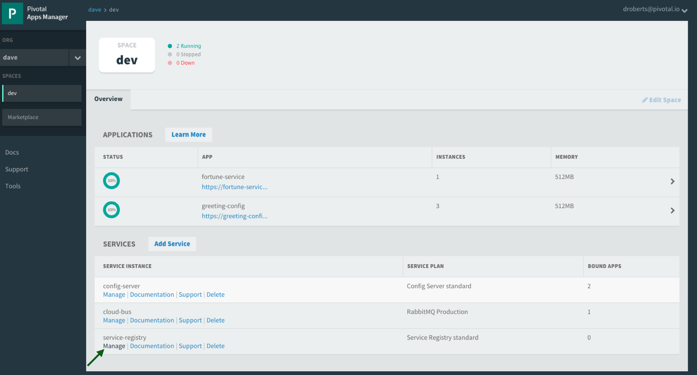

# Spring Cloud Netflix: Service Discovery

<!-- TOC depth:6 withLinks:1 updateOnSave:1 orderedList:0 -->

- [Spring Cloud Netflix: Service Discovery](#spring-cloud-netflix-service-discovery)
	- [Requirements](#requirements)
	- [What You Will Learn](#what-you-will-learn)
	- [Exercises](#exercises)
		- [Set up the `app-config` Repo](#set-up-the-app-config-repo)
		- [Set up `config-server`](#set-up-config-server)
		- [Set up `service-registry`](#set-up-service-registry)
		- [Set up `fortune-service`](#set-up-fortune-service)
		- [Set up `greeting-service`](#set-up-greeting-service)
		- [Optionally Update App Config for `fortune-service` and `greeting-service` to run on PCF](#optionally-update-app-config-for-fortune-service-and-greeting-service-to-run-on-pcf)
		- [Deploy the `fortune-service` to PCF](#deploy-the-fortune-service-to-pcf)
		- [Deploy the `greeting-service` app to PCF](#deploy-the-greeting-service-app-to-pcf)
		- [Scale the `fortune-service`](#scale-the-fortune-service)
<!-- /TOC -->

Estimated Time: 45 minutes

## Requirements

[Lab Requirements](../requirements.md)

## What You Will Learn

* How to embed Eureka in a Spring Boot application
* How to register services (`greeting-service` and `fortune-service`) with Eureka
* How to discover services (`fortune-service`) with Eureka
* How to use Spring Cloud Services to provision a Service Registry

## Exercises


### Set up the `app-config` Repo

1) Create an `$APP_CONFIG_REPO_HOME/application.yml` in your fork of the `app-config` repo with the following contents:

```yml
security:
  basic:
    enabled: false

management:
  security:
    enabled: false

logging:
  level:
    io:
      pivotal: DEBUG
```
Then commit and push back to Github.

***A note about the application.yml***

When the `config-server`'s backing repository contains an `application.yml` it is shared with all applications.  Therefore, it is a great place to put common configuration for all applications.  In this case, we have dropped security on all the endpoints and setup logging.

In the Spring Cloud Config Lab, we used application specific configuration files:
* One based on the application name `greeting-config.yml`
* One based on the application name + profile `greeting-config-qa.yml`

Application specific files override configuration settings in the `application.yml`.


### Set up `config-server`

1) Start the `config-server` in a terminal window.  You may have a terminal window still open from the previous lab.

```bash
$ cd $SPRING_CLOUD_SERVICES_LABS_HOME/config-server
$ mvn clean spring-boot:run
```

2) Verify the `config-server` is up.  Open a browser and fetch [http://localhost:8888/myapp/default](http://localhost:8888/myapp/default)


Note that a random application name was used and it picked up configuration from the `application.yml`.

### Set up `service-registry`

1) Review the `$SPRING_CLOUD_SERVICES_LABS_HOME/service-registry/pom.xml` file.  By adding `spring-cloud-starter-eureka-server` to the classpath this application is eligible to embed an Eureka server.

```xml
<dependency>
    <groupId>org.springframework.cloud</groupId>
    <artifactId>spring-cloud-starter-eureka-server</artifactId>
</dependency>
```

2) Review the following file: `$SPRING_CLOUD_SERVICES_LABS_HOME/service-registry/src/main/java/io/pivotal/ServiceRegistryApplication.java`.  Note the use of the ` @EnableEurekaServer` annotation that makes this application a Eureka server.

```java
 @SpringBootApplication
 @EnableEurekaServer
 public class ServiceRegistryApplication {

     public static void main(String[] args) {
         SpringApplication.run(ServiceRegistryApplication.class, args);
     }
 }
```

3). Review the following file: `$SPRING_CLOUD_SERVICES_LABS_HOME/service-registry/src/main/resources/application.yml`

```yml
 server:
   port: 8761

 eureka:
   instance:
     hostname: localhost
   client:
     registerWithEureka: false
     fetchRegistry: false
     serviceUrl:
       defaultZone: http://${eureka.instance.hostname}:${server.port}/eureka/
```
***About Eureka***

Eureka is designed for peer awareness (running multiple instances with knowledge of each other) to further increase availability.  Because of this, Eureka is not only a server but a client as well.  Therefore, Eureka Servers will be clients to each other.  `Eureka Server A` ⇄ `Eureka Server B`.

For the purposes of this lab, we will simplify that configuration to run in standalone mode.  

Standlalone mode still offers a high degree of resilience with:

* Heartbeats between the client and server to keep registrations up to date
* Client side caching, so that clients don't go to Eureka for every lookup
* By running in Cloud Foundry which is designed to keep applications up by design

With the above configuration, we have configured Eureka to run in standalone mode.

***Understanding the configuration parameters***

* `eureka.instance.hostname` - the hostname for this service. In this case, what host to use to reach our standalone Eureka instance.
* `eureka.client.registerWithEureka` - should this application (our standalone Eureka instance) register with Eureka
* `eureka.client.fetchRegistry` - should this application (our stand alone Eureka instance) fetch the registry (for how to discover services)
* `eureka.client.serviceUrl.defaultZone` - the Eureka instance to use for registering and discovering services.  Notice it is pointing to itself (`localhost`, `8761`).

4) Open a new terminal window.  Start the `service-registry`.

```bash
$ cd $SPRING_CLOUD_SERVICES_LABS_HOME/service-registry
$ mvn clean spring-boot:run
```

5) Verify the `service-registry` is up.  Browse to [http://localhost:8761/](http://localhost:8761/)


### Set up `fortune-service`

1) Review the `$SPRING_CLOUD_SERVICES_LABS_HOME/fortune-service/src/main/resources/bootstrap.yml` file.  The name of this app is `fortune-service`.  It also uses the `config-server`.

```yml
 server:
   port: 8787
 spring:
   application:
     name: fortune-service
```

`spring.application.name` is the name the application will use when registering with Eureka.

2) Review the `$SPRING_CLOUD_SERVICES_LABS_HOME/fortune-service/pom.xml` file.  By adding `spring-cloud-services-starter-service-registry` to the classpath this application is eligible to register and discover services with the `service-registry`.

```xml
<dependency>
	<groupId>io.pivotal.spring.cloud</groupId>
	<artifactId>spring-cloud-services-starter-service-registry</artifactId>
</dependency>
```

3) Review the following file: `$SPRING_CLOUD_SERVICES_LABS_HOME/fortune-service/src/main/java/io/pivotal/FortuneServiceApplication.java`.  Notice the `@EnableDiscoveryClient`.  This enables a discovery client that registers the `fortune-service` with the `service-registry` application.

```java
@SpringBootApplication
@EnableDiscoveryClient
public class FortuneServiceApplication {

    public static void main(String[] args) {
        SpringApplication.run(FortuneServiceApplication.class, args);
    }
}
```

4) Open a new terminal window.  Start the `fortune-service`

 ```bash
$ cd $SPRING_CLOUD_SERVICES_LABS_HOME/fortune-service
$ mvn clean spring-boot:run
```

5) After the a few moments, check the `service-registry` dashboard.  Confirm the `fortune-service` is registered.


The Eureka Dashboard may report a warning, because we aren't setup with multiple peers.  This can safely be ignored.


### Set up `greeting-service`

1) Review the `$SPRING_CLOUD_SERVICES_LABS_HOME/greeting-service/src/main/resources/bootstrap.yml` file.  The name of this app is `greeting-service`.  It also uses the `config-server`.

```yml
 server:
   port: 8080
 spring:
   application:
     name: greeting-service
```

2) Review the `$SPRING_CLOUD_SERVICES_LABS_HOME/greeting-service/pom.xml` file.  By adding `spring-cloud-services-starter-service-registry` to the classpath this application is eligible to register and discover services with the `service-registry`.

```xml
<dependency>
	<groupId>io.pivotal.spring.cloud</groupId>
	<artifactId>spring-cloud-services-starter-service-registry</artifactId>
</dependency>
```


3) Review the following file: `$SPRING_CLOUD_SERVICES_LABS_HOME/greeting-service/src/main/java/io/pivotal/GreetingServiceApplication.java`.  Notice the `@EnableDiscoveryClient`.   This enables a discovery client that registers the `greeting-service` app with the `service-registry`.

 ```java
 @SpringBootApplication
 @EnableDiscoveryClient
 public class GreetingServiceApplication {


     public static void main(String[] args) {
         SpringApplication.run(GreetingServiceApplication.class, args);
     }

 }
```

4) Review the the following file: `$SPRING_CLOUD_SERVICES_LABS_HOME/greeting-service/src/main/java/io/pivotal/greeting/GreetingController.java`.  Notice the `DiscoveryClient`.  `DiscoveryClient` is used to discover services registered with the `service-registry`.  See `fetchFortuneServiceUrl()`.

```java
@Controller
public class GreetingController {

	Logger logger = LoggerFactory
			.getLogger(GreetingController.class);


	@Autowired
	private DiscoveryClient discoveryClient;

	@RequestMapping("/")
	String getGreeting(Model model){

		logger.debug("Adding greeting");
		model.addAttribute("msg", "Greetings!!!");


		RestTemplate restTemplate = new RestTemplate();
        String fortune = restTemplate.getForObject(fetchFortuneServiceUrl(), String.class);

		logger.debug("Adding fortune");
		model.addAttribute("fortune", fortune);

		//resolves to the greeting.vm velocity template
		return "greeting";
	}

	private String fetchFortuneServiceUrl() {
	    InstanceInfo instance = discoveryClient.getNextServerFromEureka("FORTUNE-SERVICE", false);
	    logger.debug("instanceID: {}", instance.getId());

	    String fortuneServiceUrl = instance.getHomePageUrl();
		  logger.debug("fortune service homePageUrl: {}", fortuneServiceUrl);

	    return fortuneServiceUrl;
	}

}
```

5) Open a new terminal window.  Start the `greeting-service` app

 ```bash
$ cd $SPRING_CLOUD_SERVICES_LABS_HOME/greeting-service
$ mvn clean spring-boot:run
```

6) After the a few moments, check the `service-registry` [dashboard](http://localhost:8761).  Confirm the `greeting-service` app is registered.


7) [Browse](http://localhost:8080/) to the `greeting-service` application.  Confirm you are seeing fortunes.  Refresh as desired.  Also review the terminal output for the `greeting-service`.  See the `fortune-service` `instanceId` and `homePageUrl` being logged.

***What Just Happened?***

The `greeting-service` application was able to discover how to reach the `fortune-service` via the `service-registry` (Eureka).

8) When done stop the `config-server`, `service-registry`, `fortune-service` and `greeting-service` applications.


### Optionally Update App Config for `fortune-service` and `greeting-service` to run on PCF

1) You may specify the registration method to use for the applications using the `spring.cloud.services.registrationMethod` parameter.

It can take either of two values:

`route`: The application will be registered using its Cloud Foundry route (this is the default).

`direct`: The application will be registered using its host IP and port.

The `direct` registration method is only compatible with Pivotal Cloud Foundry version 1.5 or higher. In Pivotal Cloud Foundry Operations Manager, within the Pivotal Elastic Runtime tile’s Security Config, the “Enable cross-container traffic within each DEA” or “Enable cross-container traffic” option must be enabled.

When using the `direct` registration method, requests from client applications to registered applications will not go through the Pivotal Cloud Foundry `router`. You can utilize this with client-side load balancing techniques using [Spring Cloud and Netflix Ribbon](http://projects.spring.io/spring-cloud/docs/1.0.3/spring-cloud.html#spring-cloud-ribbon). To read more on registration techniques go [here](http://docs.pivotal.io/spring-cloud-services/service-registry/registering-a-service.html).

If cross container traffic has been enabled, in your fork of the `app-config` repo add an additional section to the `$APP_CONFIG_REPO_HOME/application.yml` file as seen below.  If using the `route` option then no change is needed; move to the next step.

```yml
security:
  basic:
    enabled: false

management:
  security:
    enabled: false

logging:
  level:
    io:
      pivotal: DEBUG

spring: # <---NEW SECTION
  cloud:
    services:
      registrationMethod: direct
```

### Deploy the `fortune-service` to PCF

1) Package `fortune-service`

```bash
$ mvn clean package
```

2) Deploy `fortune-service`.

```bash
$ cf push fortune-service -p target/fortune-service-0.0.1-SNAPSHOT.jar -m 512M --random-route --no-start
```

3) Create a Service Registry Service Instance.  The `service-registry` service instance will not be immediately bindable.  It needs a few moments to initialize.

```bash
$ cf create-service p-service-registry standard service-registry
```

Click on the ***Manage*** link to determine when the `service-registry` is ready.




4) Bind services to the `fortune-service`.  

```bash
$ cf bind-service fortune-service config-server
$ cf bind-service fortune-service service-registry
```

You will need to wait and try again if you see the following message when binding the `service-registry`:

```
Binding service service-registry to app fortune-service in org dave / space dev as droberts@pivotal.io...
FAILED
Server error, status code: 502, error code: 10001, message: Service broker error: Service instance is not running and available for binding.
```

You can safely ignore the _TIP: Use 'cf restage' to ensure your env variable changes take effect_ message from the CLI.  We don't need to restage at this time.


5) If using self-signed certificates, set the `CF_TARGET` environment variable for the `fortune-service` application.

```bash
$ cf set-env fortune-service CF_TARGET <your api endpoint - make sure it starts with "https://">
```

You can safely ignore the _TIP: Use 'cf restage' to ensure your env variable changes take effect_ message from the CLI.  We don't need to restage at this time.

6) Start the `fortune-service` app.

```bash
$ cf start fortune-service
```

7) Confirm `fortune-service` registered with the `service-registry`.  This will take a few moments.

Click on the ***Manage*** link for the `service-registry`.  You can find it by navigating to the space where your applications are deployed.


### Deploy the `greeting-service` app to PCF

1) Package `greeting-service`

```bash
$ mvn clean package
```

2) Deploy `greeting-service`.

```bash
$ cf push greeting-service -p target/greeting-service-0.0.1-SNAPSHOT.jar -m 512M --random-route --no-start
```

3) Bind services for the `greeting-service`.

```bash
$ cf bind-service greeting-service config-server
$ cf bind-service greeting-service service-registry
```
You can safely ignore the _TIP: Use 'cf restage' to ensure your env variable changes take effect_ message from the CLI.  We don't need to restage at this time.

4) If using self signed certificates, set the `CF_TARGET` environment variable for the `greeting-service` application.

```bash
$ cf set-env greeting-service CF_TARGET <your api endpoint - make sure it starts with "https://">
```

You can safely ignore the _TIP: Use 'cf restage' to ensure your env variable changes take effect_ message from the CLI.  We don't need to restage at this time.


5) Start the `greeting-service` app.

```bash
$ cf start greeting-service
```


6) Confirm `greeting-service` registered with the `service-registry`.  This will take a few moments.


7) Browse to the `greeting-service` application.  Confirm you are seeing fortunes.  Refresh as desired.

### Scale the `fortune-service`

1) Scale the `fortune-service` app instances to 3.

```
$ cf scale fortune-service -i 3
```

2) Wait for the new instances to register with the `service-registry`.  This will take a few moments.

3) Tail the logs for the `greeting-service` application.

```bash
[mac, linux]
$ cf logs greeting-service | grep GreetingController

[windows]
$ cf logs greeting-service
$ # then search output for "GreetingController"
```

4) Refresh the `greeting-service` `/` endpoint.

5) Observe the log output.  Compare the `instanceId`s and `homePageUrl`s being logged. The `discoveryClient` round robins the `fortune-service` instances.

```
2015-10-29T15:49:56.48-0500 [APP/0]      OUT 2015-10-29 20:49:56.481 DEBUG 23 --- [nio-8080-exec-1] io.pivotal.greeting.GreetingController   : Adding greeting
2015-10-29T15:49:56.49-0500 [APP/0]      OUT 2015-10-29 20:49:56.497 DEBUG 23 --- [nio-8080-exec-1] io.pivotal.greeting.GreetingController   : instanceID: 10.68.104.27:9f960352-f80b-4316-7577-61dd1815ac5f
2015-10-29T15:49:56.49-0500 [APP/0]      OUT 2015-10-29 20:49:56.498 DEBUG 23 --- [nio-8080-exec-1] io.pivotal.greeting.GreetingController   : fortune service homePageUrl: http://10.68.104.27:60028/
2015-10-29T15:49:56.50-0500 [APP/0]      OUT 2015-10-29 20:49:56.507 DEBUG 23 --- [nio-8080-exec-1] io.pivotal.greeting.GreetingController   : Adding fortune
2015-10-29T15:49:57.72-0500 [APP/0]      OUT 2015-10-29 20:49:57.722 DEBUG 23 --- [nio-8080-exec-6] io.pivotal.greeting.GreetingController   : Adding greeting
2015-10-29T15:49:57.73-0500 [APP/0]      OUT 2015-10-29 20:49:57.737 DEBUG 23 --- [nio-8080-exec-6] io.pivotal.greeting.GreetingController   : instanceID: 10.68.104.28:72aa9f59-b27f-4d85-4323-2d79a9d7720c
2015-10-29T15:49:57.73-0500 [APP/0]      OUT 2015-10-29 20:49:57.737 DEBUG 23 --- [nio-8080-exec-6] io.pivotal.greeting.GreetingController   : fortune service homePageUrl: http://10.68.104.28:60026/
2015-10-29T15:49:57.74-0500 [APP/0]      OUT 2015-10-29 20:49:57.745 DEBUG 23 --- [nio-8080-exec-6] io.pivotal.greeting.GreetingController   : Adding fortune
2015-10-29T15:49:58.66-0500 [APP/0]      OUT 2015-10-29 20:49:58.660 DEBUG 23 --- [nio-8080-exec-2] io.pivotal.greeting.GreetingController   : Adding greeting
2015-10-29T15:49:58.67-0500 [APP/0]      OUT 2015-10-29 20:49:58.672 DEBUG 23 --- [nio-8080-exec-2] io.pivotal.greeting.GreetingController   : instanceID: 10.68.104.29:e117fae6-b847-42c7-5286-8662a993351e
2015-10-29T15:49:58.67-0500 [APP/0]      OUT 2015-10-29 20:49:58.673 DEBUG 23 --- [nio-8080-exec-2] io.pivotal.greeting.GreetingController   : fortune service homePageUrl: http://10.68.104.29:60020/
2015-10-29T15:49:58.68-0500 [APP/0]      OUT 2015-10-29 20:49:58.682 DEBUG 23 --- [nio-8080-exec-2] io.pivotal.greeting.GreetingController   : Adding fortune
2015-10-29T15:49:59.60-0500 [APP/0]      OUT 2015-10-29 20:49:59.609 DEBUG 23 --- [io-8080-exec-10] io.pivotal.greeting.GreetingController   : Adding greeting
2015-10-29T15:49:59.62-0500 [APP/0]      OUT 2015-10-29 20:49:59.626 DEBUG 23 --- [io-8080-exec-10] io.pivotal.greeting.GreetingController   : instanceID: 10.68.104.27:9f960352-f80b-4316-7577-61dd1815ac5f
2015-10-29T15:49:59.62-0500 [APP/0]      OUT 2015-10-29 20:49:59.626 DEBUG 23 --- [io-8080-exec-10] io.pivotal.greeting.GreetingController   : fortune service homePageUrl: http://10.68.104.27:60028/
2015-10-29T15:49:59.63-0500 [APP/0]      OUT 2015-10-29 20:49:59.637 DEBUG 23 --- [io-8080-exec-10] io.pivotal.greeting.GreetingController   : Adding fortune
2015-10-29T15:50:00.54-0500 [APP/0]      OUT 2015-10-29 20:50:00.548 DEBUG 23 --- [nio-8080-exec-1] io.pivotal.greeting.GreetingController   : Adding greeting
2015-10-29T15:50:00.56-0500 [APP/0]      OUT 2015-10-29 20:50:00.564 DEBUG 23 --- [nio-8080-exec-1] io.pivotal.greeting.GreetingController   : instanceID: 10.68.104.28:72aa9f59-b27f-4d85-4323-2d79a9d7720c
2015-10-29T15:50:00.56-0500 [APP/0]      OUT 2015-10-29 20:50:00.564 DEBUG 23 --- [nio-8080-exec-1] io.pivotal.greeting.GreetingController   : fortune service homePageUrl: http://10.68.104.28:60026/
2015-10-29T15:50:00.57-0500 [APP/0]      OUT 2015-10-29 20:50:00.572 DEBUG 23 --- [nio-8080-exec-1] io.pivotal.greeting.GreetingController   : Adding fortune
```

***What Just Happened?***

The `greeting-service` and `fortune-service` both registered with the `service-registry` (Eureka).  The `greeting-service` was able to locate the `fortune-service` via the `service-registry`.  The `greeting-service` round robins requests to all the `fortune-service` instances.
